# 概述

## 软件概述

《中建八局快模系统》（以下简称快模）是基于Revit的二次开发插件，该插件在Revit的功能基础上扩展、优化并提供了适合和满足国内施工行业要求的系列工具模块；快模提供了土建、机电、装饰等专业的高效功能工具以及通用的系列工具，可以基于传统的设计图纸进行三维BIM模型快速转换，也可以在已有的BIM模型基础上进行施工的二次深化，同时提供了装饰装修模块，基本满足地砖、吊顶、面砖、砌块等粗装需求；快模软件助您发掘BIM模型的价值！

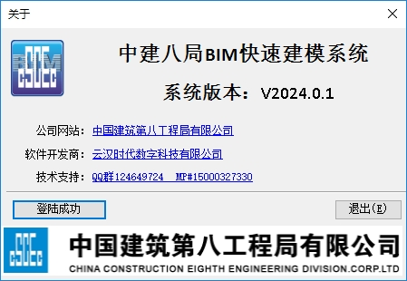

## 软件安装

直接双击提供的最新安装包（比如中建八局BIM快速建模系统[2018-2024]版20231218_21.0.2）,弹出安装界面后点击下一步按钮；

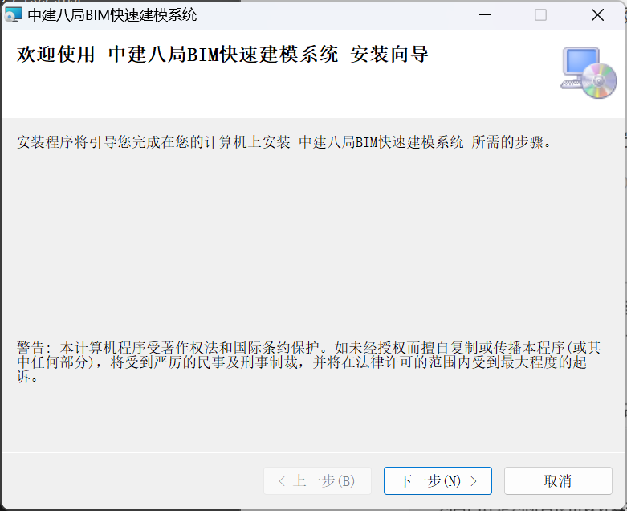

在选择安装路径时，您可以具体指定安装的路径，然后点击下一步按钮:

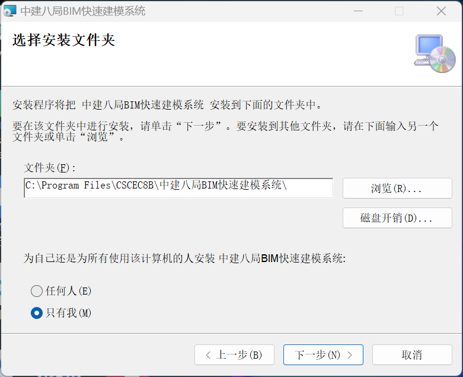

安装完成后，显示安装完成界面，点击关闭按钮，完成安装。

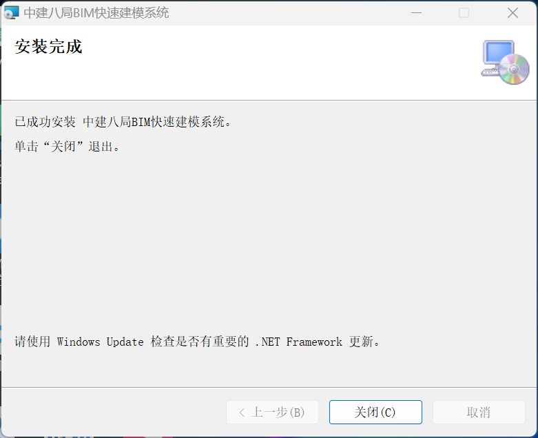

注意：如果当前Windows账号的权限不是管理员，软件安装或启动时可能出错，此时软件安装路径最好指定为非Windows系统盘下面。

本安装包集成了Revit 2018、2019、2020、2021、2022、2023、2024，七个版本的支持，如果您的机器上还没有安装包最新版的Revit，安装包在安装过程可能会提示需要安装.Net 4.7包，此时您可以到微软网站进行相关安装包的下载安装后即可解决这个问题：

https://www.microsoft.com/en-us/download/details.aspx?id=56116

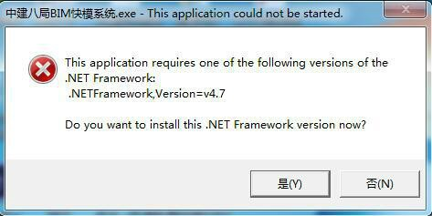

## 软件启动

软件安装后，打开Revit 2024软件，快摸插件首次安装完成后，打开Revit，弹窗点击总是载入按钮。

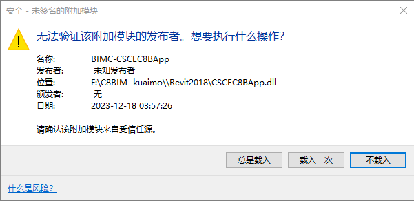

## 操作界面入口

在Revit中部署好插件后，启动Revit，在Tab上会看到如下图所示的快速建模程序操作界面入口，点击关于选项进行软件注册，根据授权的模块不同，可能会出现不同的Tab入口，如下图所示。

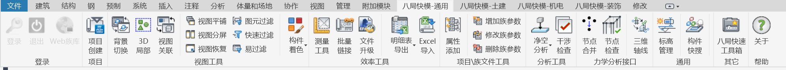

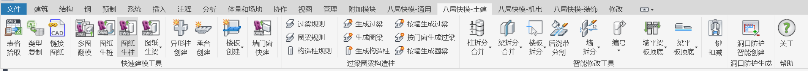

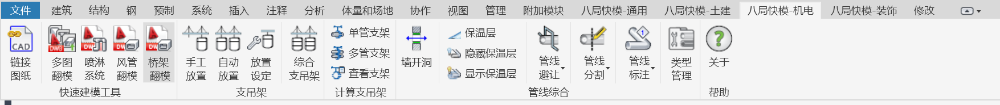

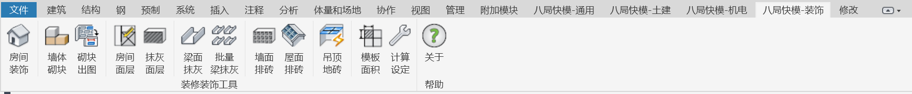

## 软件激活

为了使用软件，需要进行软件的激活：

从任意八局工具的Tab上点击”关于”命令

弹出登录界面，填写八局通账号及密码点击登录。或者点击扫码登录，用八局通app扫码登录。

登录完成后，弹出关于界面，点击右上角X按钮关闭。

## 程序约定

为了保证程序的准确运行，请遵循以下的程序约定：

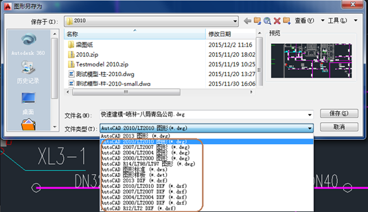

1.目前链接和导入的CAD图纸，程序都可以处理，都可以正确的进行桩、柱、梁、喷淋等的识别和图层提取。两种的区别在于以后对DWG中标注文字的提取，根据目前的技术方案，只有链接的CAD图纸才能正确获取文字信息。

2.插入连接模型时，应该是注意插入时的单位及原点设置，请选择“毫米单位”和“自动-原点到原点”的插入方式，否则插入的连接模型不能被正确识别和创建：

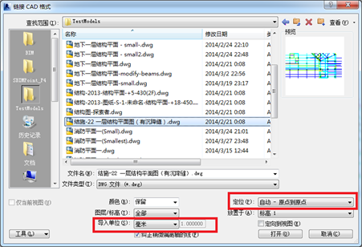

# 通用模块

## 族库系统

### 登录

进行用户登录操作

点击登陆按钮，可设置登录名、密码，选择服务器即可进行登陆，可勾选记住密码，方便下次登陆的时候不需要再次输入密码。

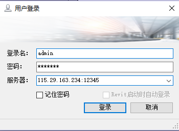

### 退出

用户没有登陆之前，按钮将显示为不可点击的灰色。

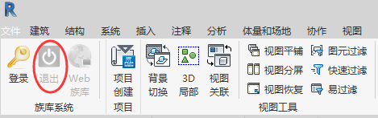

用户登录之后，退出按钮显示为红色。运行命令，点击“退出”按钮，将会退出用户登录状态。

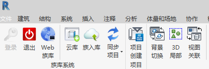

### Web族库

单机Web族库按钮，系统将自动跳转到族库网页。族库里有各个revit各个版本对应的多种不同类型的族。

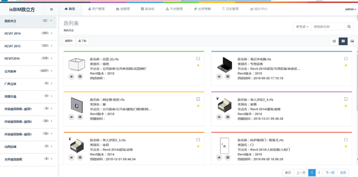

### 云库

点击云库按钮，系统将弹出族库界面。这个族库界面里的所有族是对应Web族库里面的族，族库里有各个revit版本对应的多种不同类型的族，可以直接进行应用。

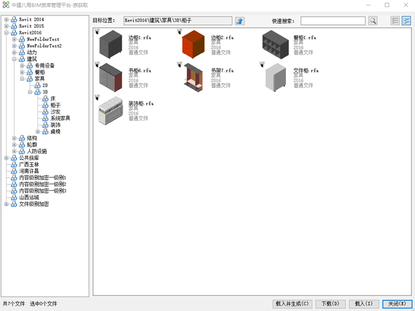

此时我们可以点击载入并生成，即可把族应用到项目里边，点击下载或载入按钮将会把族下载或载入至本地默认目录。

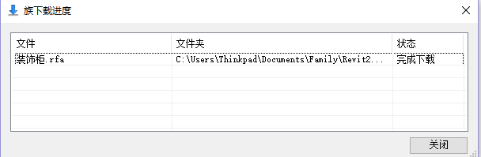

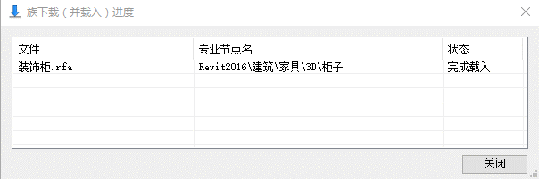

### 族入库

点击族入库按钮，系统将弹出族入库界面。

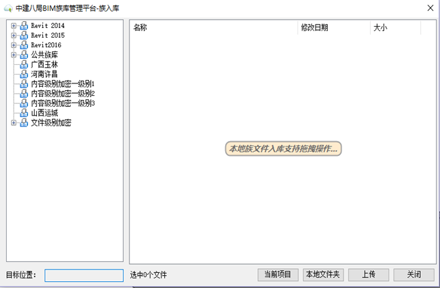

点击当前项目按钮，系统会自动把当前项目所对应的族都显示在当前族入库界面中。

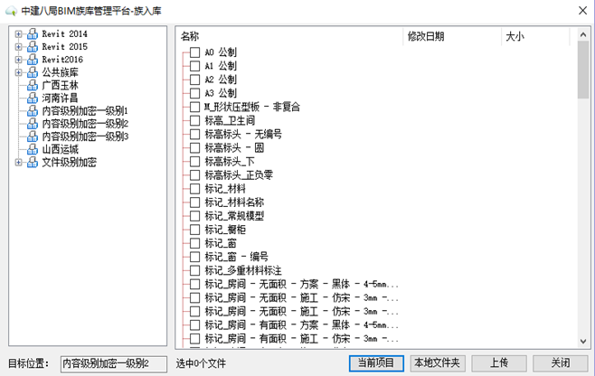

通过选择当前项目所对应的族，可以点击上传按钮，我们可以把族入库里面的族上传至族库。 

此时我们可以点击载入并生成，即可把族应用到项目里边，点击下载或载入按钮将会把族下载或载入至本地默认目录。

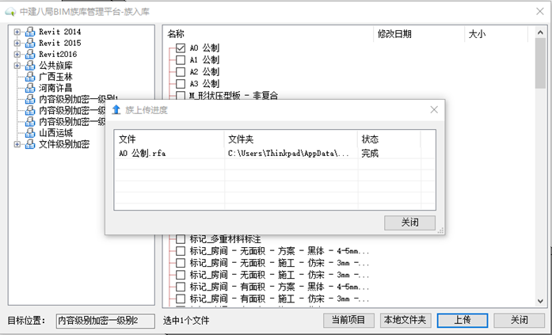

### 同步项目

1.同步项目

点击同步项目下拉按钮下面的同步项目，系统将弹出这样一个界面。

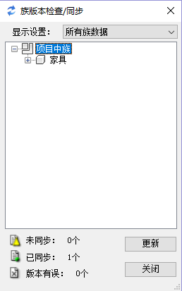

我们可以很明显的看出未同步的项目跟已经同步的项目，在上面的现实设置的右边有一个下拉按钮，可以分别筛选已同步的族、未同步的族以及版本有误的族。点击更新按钮将对当前项目同步情况进行重新识别。

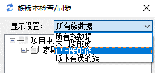

2) 同步工作目录

单机同步工作目录按钮会弹出这样一个界面。他的目的是检查当前正在工作状态下的族是否处于同步状态，并统计处于同步状态下的族分别是哪些，未同步的族是哪些。其他功能按钮与同步项目界面的按钮功能保持一致。

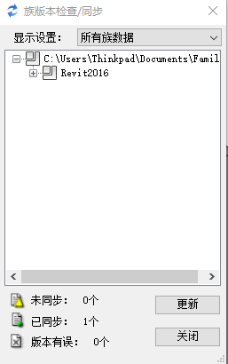

## 视图工具

### 背景切换

进行建模区域背景颜色黑白的快速一键切换

点击背景切换按钮，视图窗口的背景颜色快速在黑色、白色之间一键切换。

（注：本功能仅支持Revit2016及以后的版本，之前的版本将弹出对话框由用户进行设置。）

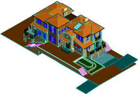

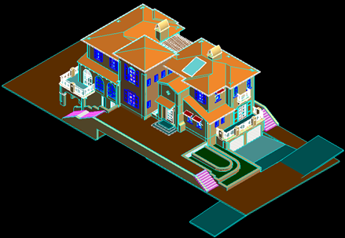

### 局部3D

运行命令，在绘图区框选需要查看的局部构件，点击“完成”按钮。

操作完成后，绘图区显示框选局部的剖析内容。剖析框可以拉动，便于查看局部内容。

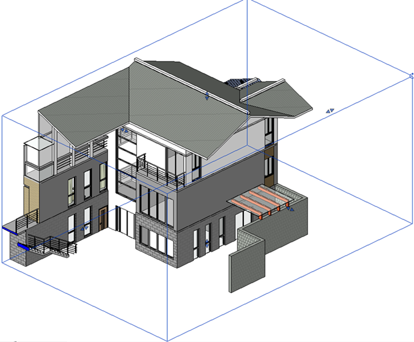

也可以在二维图纸上创建剖析框查看。

选择一个楼层平面，点击“3D局部”，在弹出的“创建局部3D剖视图”对话框中，为创建的视图输入名称，输入偏移值（如输入向上偏移值，就是在所选标高到“向上偏移值”间创建局部剖切框。），点击“确定”按钮。

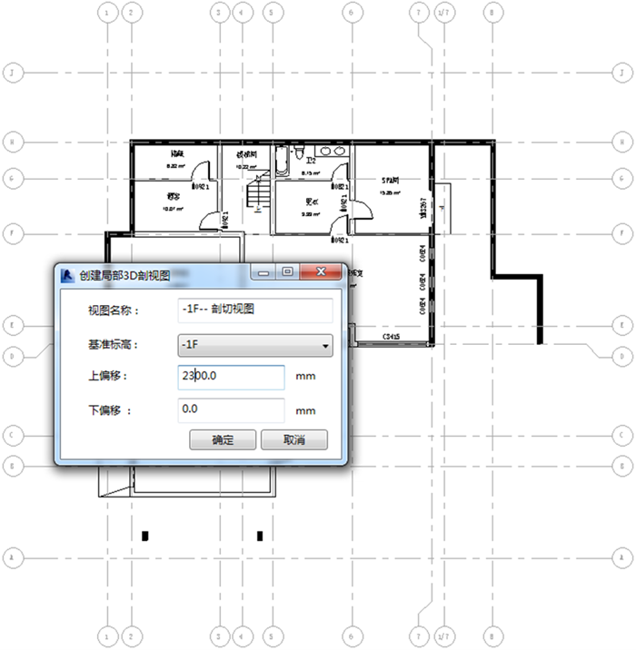

然后在绘图区框选生成剖面的区域，就会直接生成剖切框显示所选区域和标高内的局部3D视图了。

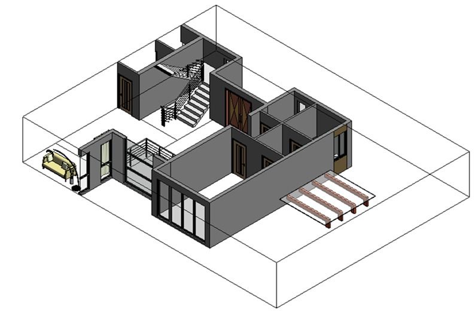

注意：

1. 在不同二维图纸中创建的“3D局部视图”可以在视图中查看和切换。在三维视图中创建的“3D局部视图”永远都是最新剖切框内容。

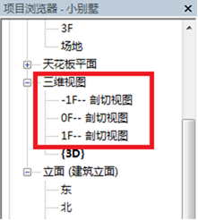

### 视图关联

通过2D/3D视图联动，在图纸打开界面下，可以通过选择打开图纸视图。

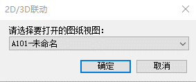

### 视图平铺、视图分屏、视图恢复

1) 视图平铺

所有打开的视图，以平铺方式在绘图区域展示。

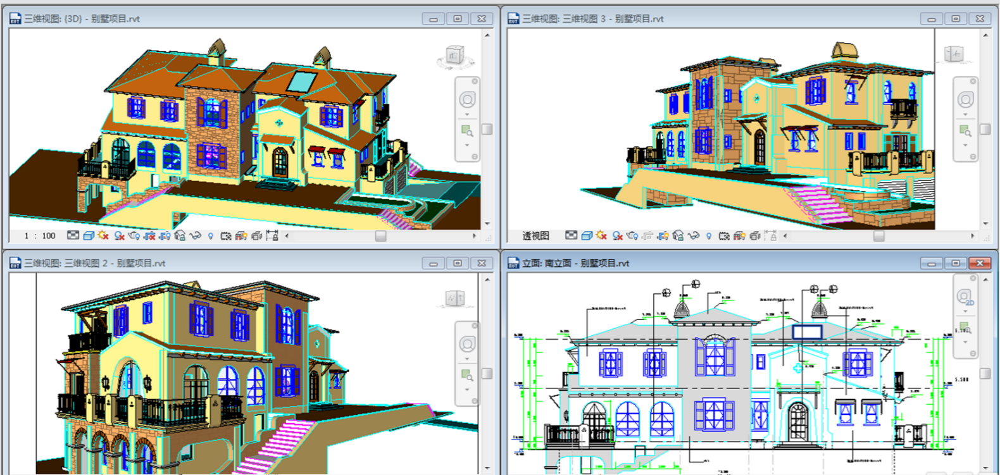

2) 视图分屏

当前的两个窗口以平铺方式显示在两个屏幕中，实现多个屏幕中显示同一个模型的需求。

3) 视图恢复

将多个屏幕中的视图恢复到一个屏幕中，方便查看和编辑。

### 图元过滤、快速过滤、易过滤

1) 图元过滤

运行命令，在绘图区框选或点选出需要过滤的图元，将会弹出“元素过滤器”对话框。对话框中将过滤的图元分类列出。

可勾选“按属性过滤”然后在属性过滤右侧的下拉列表选择要过滤的属性

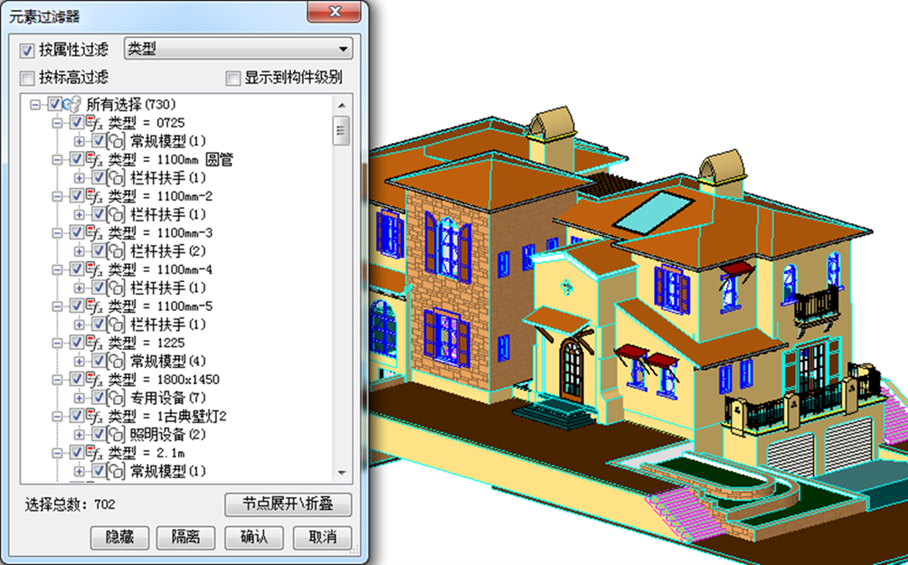

可勾选“按标高过滤”

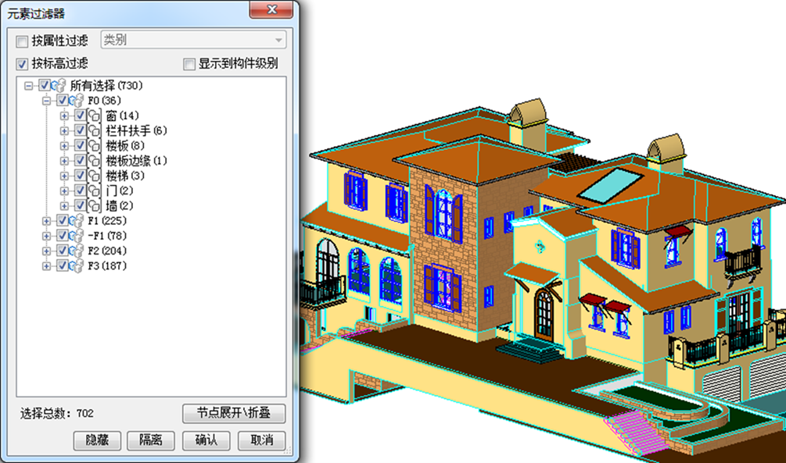

在对话框中勾选图元项，

点击“确认”按钮，可以在绘图区默认选中和显示该图元。

点击“隐藏”可以隐藏选中的图元。

点击“隔离”可以隔离显示选中的图元

2.快速过滤

点选选择构件，单击中部某一类过滤对象按钮，则该类对象均处于选中状态。

点选隐藏构件，单击中部某一类过滤对象按钮，则该类对象均被隐藏。

点选隔离构件，单击中部某一类过滤对象按钮，则该类对象被隔离显示。

单击“自定义”按钮，则弹出如下对话框。

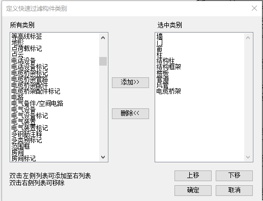

在该对话框中，左侧窗口中列出了所有可以被过滤的类别，从中选择需要定义为快速过滤按钮的类别，添加进入右侧窗口中，则该类别将会出现在快速过滤面板中，也可通过上移和下移，定义此按钮在快速选择面板中的位置。

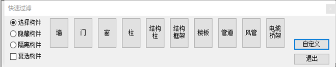

根据每个人的建模需要，经过自定义设置后的“快速过滤”面板可适用每位用户，高效、便捷的完成某类构件的快速选择、隐藏、隔离、复选。

3) 易过滤

在对话框中选中想要过滤的构件参数，点击“整个模型”按钮（也可以点击“框选”按钮，然后在绘图区框选部分模型，从中进行过滤），如下图所示。

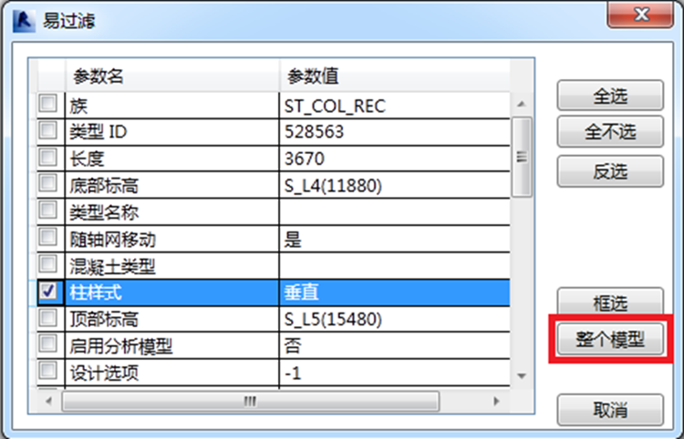

操作完成后，可以在绘图区看到模型中含有“参数名”为“柱样式”的构件都被过滤出来了，如下图所示。

### 构件着色

1) 颜色刷
   
   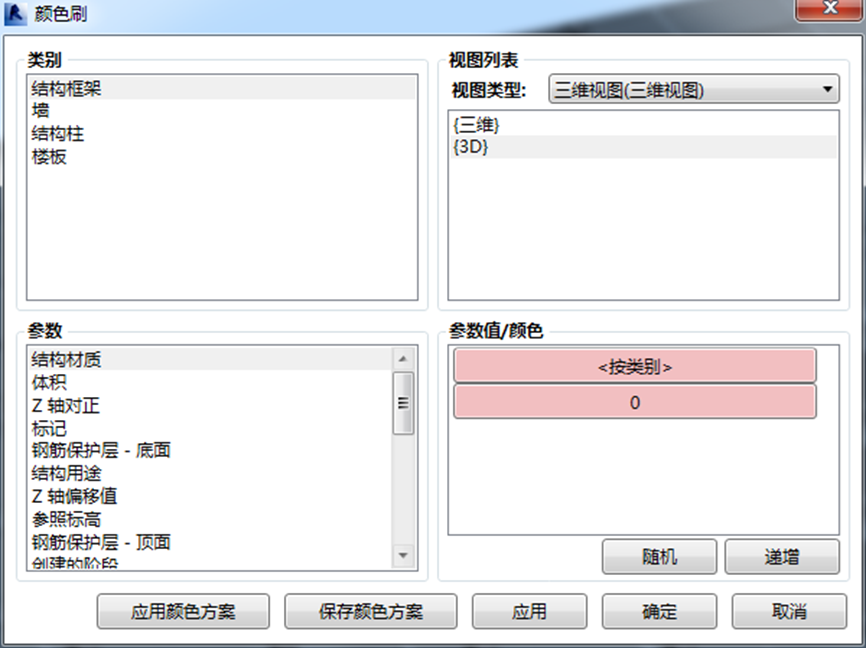

类别：选择所要修改颜色的类别；

参数：根据选择“类别”不同，会显示不同的参数；

参数值/颜色：自动获取当前“类别”、“参数”的值，并列举到界面中。界面中的颜色支持手动点击修改；

随机：点击后可以随机调整着色参数；

递增：点击后可以将着色颜色修改为递增效果；

视图列表：用于选择所要生成效果的界面；

保存颜色方案：保存当前颜色方案；

应用颜色方案：选择已经保存的颜色方案；

应用效果：用颜色区分升降。

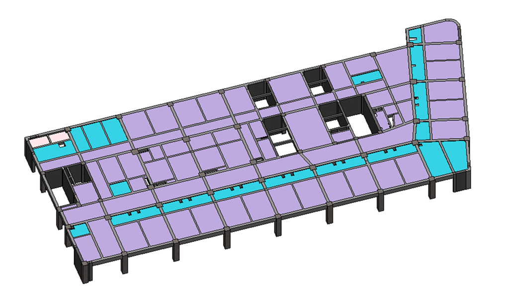

2) 梁着色

运行命令，首先框选需要着色的梁图元，选择完成后弹出梁着色界面。

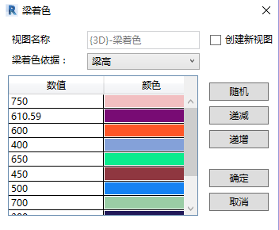

三维视图名称：命名一个用于展示效果的新视图名称。

梁着色依据：一共有三种着色依据，梁高、底部高程、顶部高程。

梁高：按照梁高的颜色进行着色；

底部高程：按照梁底部的高程值进行着色；

顶部高程：按照梁顶部的高程值进行着色。

随机：随机选择一组颜色方案；

递减：将颜色由深到浅排列；

递增：将颜色由浅到深排列；

确定：应用当前方案。

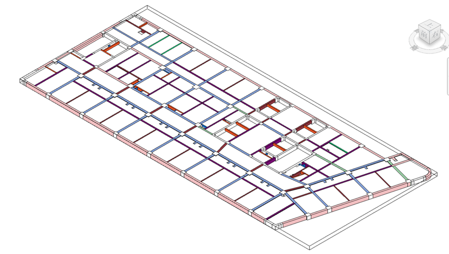

3) 构件颜色

运行构件颜色命令，在弹出的“着色选项”对话框中点击“新建集合”按钮。

之后在选择编辑构件中添加到集合按钮，在绘图区选中要添加放入到集合中的构件，点击“完成”按钮。

在刷新显示的集合列表中输入集合名称，选择构件显示颜色，设定透明度，点击“确定”按钮。

回到绘图区可以看到所选构件都是设定颜色显示。

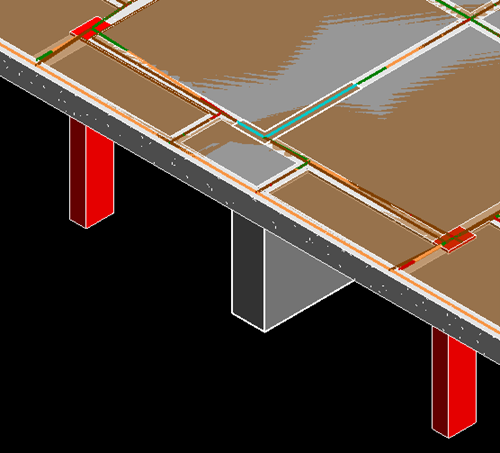

也可以删除和清空此集合。

添加和删除构件：

在“通用工具”区域选择点击“构件着色”下拉按钮里面的“构件颜色”。在弹出的“构件颜色”对话框中点击“选择集合”，点击“添加到集合”按钮。

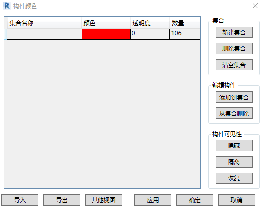

回到绘图区可以看到所选的构件也显示为设定颜色。

删除集合中构件操作与附加到集合操作类似，，选择点击“构件颜色”。在弹出的“着色选项”对话框中点击“选择集合”， 在绘图区选择要从集合中删除的构件，选中要删除构件的集合，点击“从集合删除”按钮，点击“确定”按钮。

回到绘图区可以看到所选的构件显示为原色。

集合列表导出、导入：

对于定义好的集合名称、名称对应的颜色，可以点击“导出”按钮,可以生成“*.xml”文件，在其他项目中，可以点击“导入”按钮，导入此集合名称和颜色对应列表。

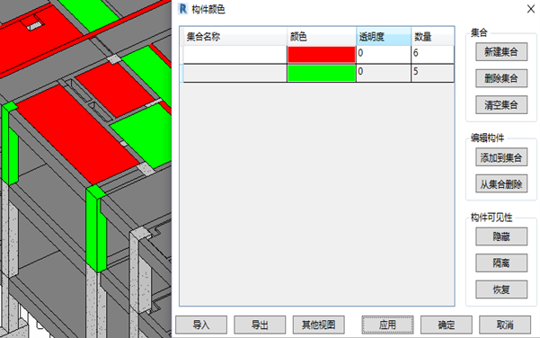

4.构件材质

运行命令，首先选择墙、梁或柱图元，选择完成后看，单击完成。弹出材质设置界面。

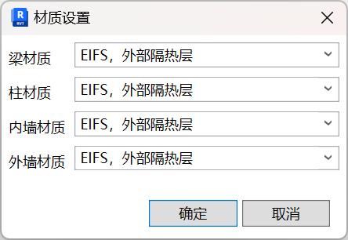

点击下拉列表，选择材质，单击确定按钮，完成材质设置。

## 效率工具

### 测量工具

运行测量工具命令，显示“测量工具”对话框，分为“面积”、“长度”、“三维距离”、“多边形面积”和“点面距离”五个选项板，如下图所示。

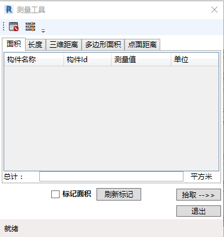

对话框上部的通用按钮分别为“清空已测量的数据”和“设置测量数据的显示选项”。

“清空已测量的数据”功能可以将当前选项板中已有的测量结果全部清空，下图中红框所标注。

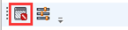

“设置测量数据的显示选项”功能可以根据需要选择单位制式和小数点精度，下图中红框所示。

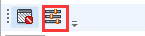

在点击“设置测量数据的显示选项”图标后，会弹出“测量工具设置”对话框，可以选择测量中使用的单位制式，单位制式设定后，点击“保存”按钮。

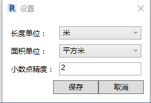

在“测量工具”窗口中，选择“面积”选项板，点击“拾取”按钮，在绘图区选择要测量面积的构件表面，然后点击“确定”按钮，如下图所示。

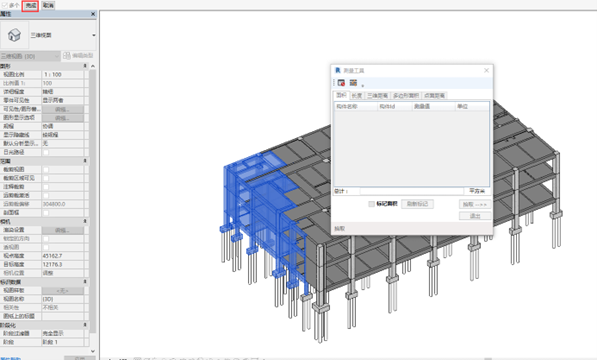

然后“测量工具”对话框中，会分别显示所选构件的“构件名称”、“构件ID”、“测量值”、“单位”等信息，如下图所示。

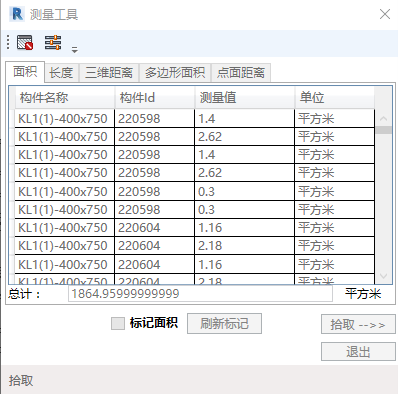

在“测量工具”窗口中，选择“长度”选项板，点击“拾取”按钮，在绘图区选择要测量面积的构件的直线线条，窗口中自动显示所选直线的长度是多少，如下图所示。

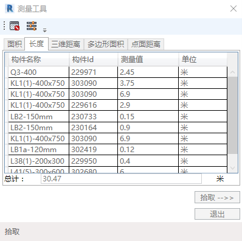

在“测量工具”窗口中，选择“三维距离”选项板，点击“拾取”按钮，在绘图区选择不同的点，窗口中自动显示所选点与前一个选择点的三维空间距离是多少。

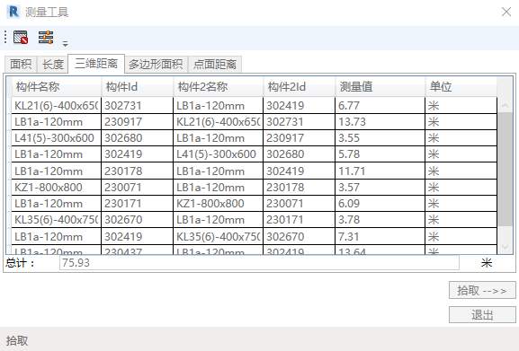

在“测量工具”窗口中，选择“多边形面积”选项板，点击“拾取”按钮。进入绘图区，通过选择点连成线，组成多边形（所有点必须在同一平面，连接成多边形后再次点击第一个点才能算完成），窗口中会自动显示个点的坐标和组成多边形的面积，如下图所示。

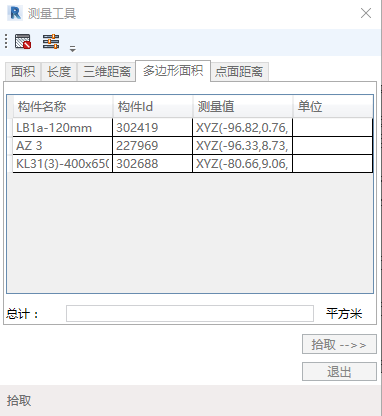

在“测量工具”窗口中，选择“点面距离”选项板，点击“拾取”按钮。进入绘图区，选择一个点，然后选择一个构件表面，窗口中会自动显示这个点的坐标和到所选面的距离，如下图所示。

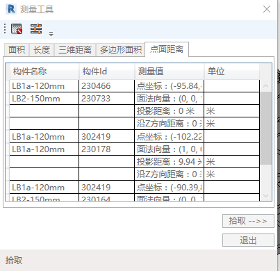

### 批量链接

运行批量链接命令，弹出“批量链接/导入”对话框，对话框上部具有“链接/导入RVT”、“链接/导入CAD”两个选项卡。

点击“链接/导入RVT”选项卡，点击“浏览”可指定RVT文件路径，点击“确定”链接RVT文件。

点击“链接/导入CAD”选项卡，点击“浏览”可指定CAD文件路径，之后可单选“导入”或者“链接”两种导入方式之一插入文件，在对话框下部可设置插入选项，如定位方式、导入单位等。

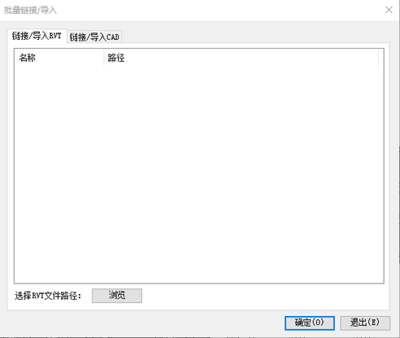

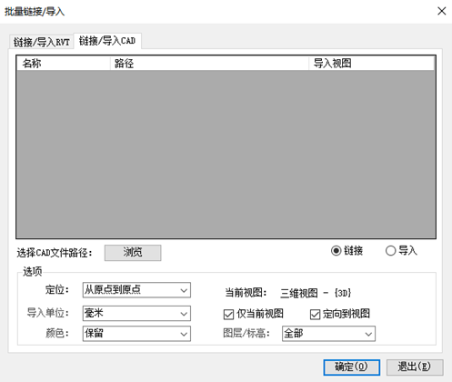

注：链接/导入CAD文件时，视图必须为楼层平面视图，若为3D视图将报错，无法继续。

### 文件升级

运行文件升级命令，在弹出的对话框中，根据需要在“升级选项”区域选择当前文件的类型，确定升级选项和附加选项信息，在“选择文件夹”区域点击“源文件”按钮选择含有需要升级文件的文件夹，点击“确定”按钮。

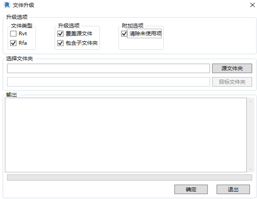

升级操作后，“输出”区域会显示升级文件的信息。对于操作失败的文件会直接跳过，继续操作，失败原因可以在“输出”区域查看．

注意：

如果“升级选项”不选择覆盖源文件，“选择文件”区域会显示“目标文件夹”选项，可以指定生成的升级文件存放路径。

如果未勾选“包含子文件夹”，操作将只针对“源文件”所选文件夹下文件，不会进入下一级文件夹。

“清除未使用项”将会把文件中没有使用的族、材质等等内容删除，使文件变小。

升级只针对低级版本进行操作，已升级和高级版本自动跳过。

“清除未使用项”对高级版本自动跳过。

### 明细表导出

1) 明细表导出

运行明细表导出命令，在弹出对话框中的“类别”显示框中选择要导出的明细表；然后在“列表项”显示框会显示所选明细表中含有的列表项，选择要导出的列表项，通过左移和右移按钮将所选列表项放到“要导出的列表项”显示框；点击“浏览”按钮选择保存目录，点击“导出”按钮，如下图所示。

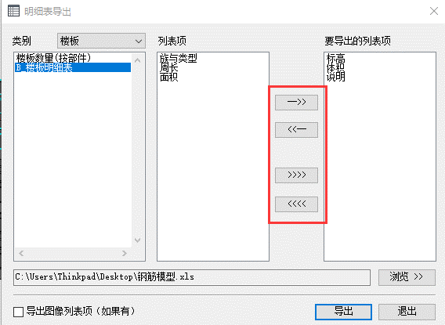

 操作完成后，会弹出成功提示是否打开Excal信息。

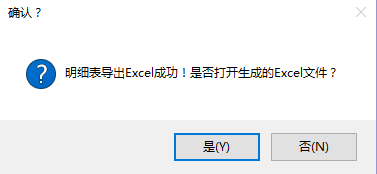

2) 批量导出

运行批量导出命令，在弹出对话框中的“明细表类别”显示框中选择要导出的明细表；然后在通过左移和右移按钮将所选项放到“要导出的明细表”显示框；点击“浏览”按钮选择保存目录，点击“导出”按钮，如下图所示。

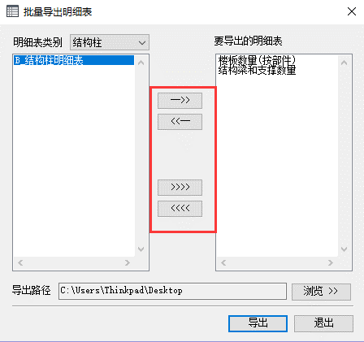

操作完成后，会弹出成功提示信息。

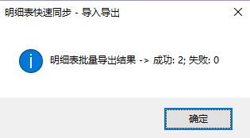

### Excel导入

弹出的“导入Excel文件”对话框中，点击“浏览”按钮，如下图所示

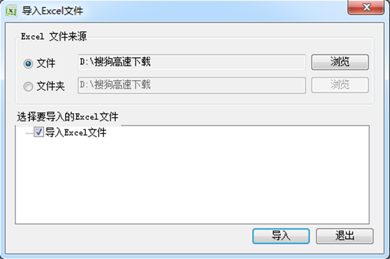

在弹出的“请指定导入Excel文件的路径和文件名”窗口中，选择要导入的Excel文件，点击“打开”按钮。

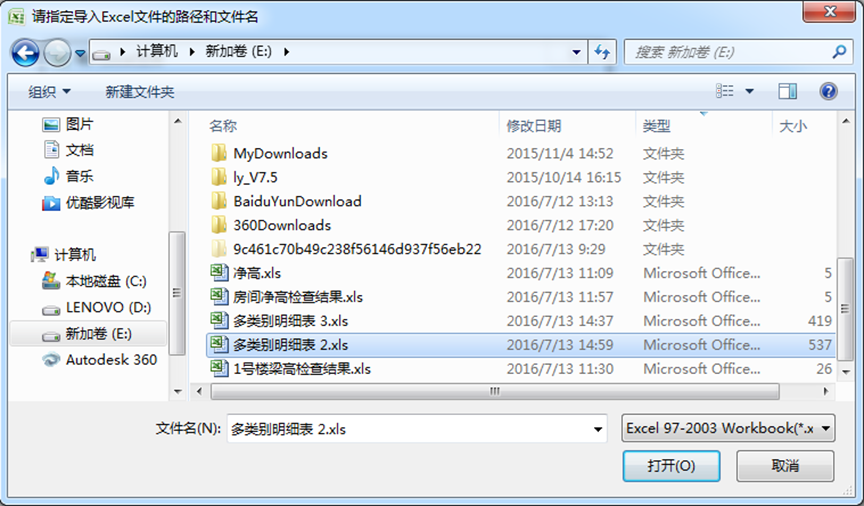

回到“导入Excel文件”对话框，点击“导入”按钮，进行导入操作。

将会弹出“明细表快速同步”提示框，点击“是”按钮，进行同步操作。

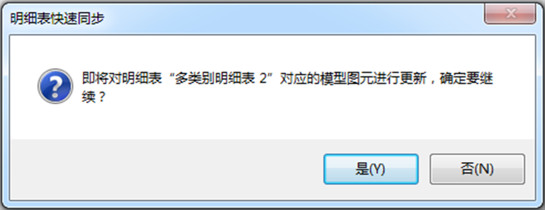

## 项目\族文件工具

### 属性添加

运行属性添加命令，弹出“添加属性”对话框。、

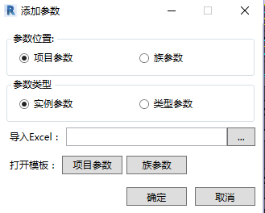

1) 共享参数

选择“共享参数”，参数类型根据需要可选择“实例参数”或者“类型参数”，打开模板“共享参数”，弹出程序内置的Excel数据格式模板。

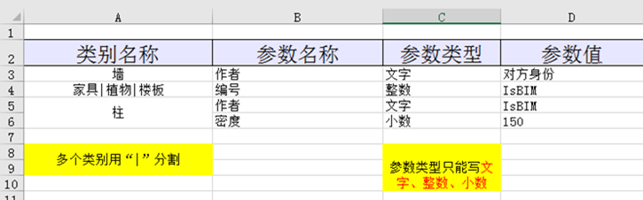

当多个类别需要添加同样的参数名称时，可按照表格中A4单元格的样式，添加竖线分割。

当一个类别需要添加多个参数名称时，可按照表格中A5、A6样式，合并单元格。

参数类型只能写“文字”、“整数”、“小数”。

“参数值”需与“参数类型”匹配。

修改好Excel之后，文件另存至其他位置，以免影响系统模板。

点击导入Excel后面的“…”按钮，浏览找到刚才另存的Excel文件。（此Excel文件不可处于打开状态）

起始位置输入Excel表格中第一个类别名称的单元格，如模板表格在此处应输入“A|3”。

点击“确定”按钮，完成操作。

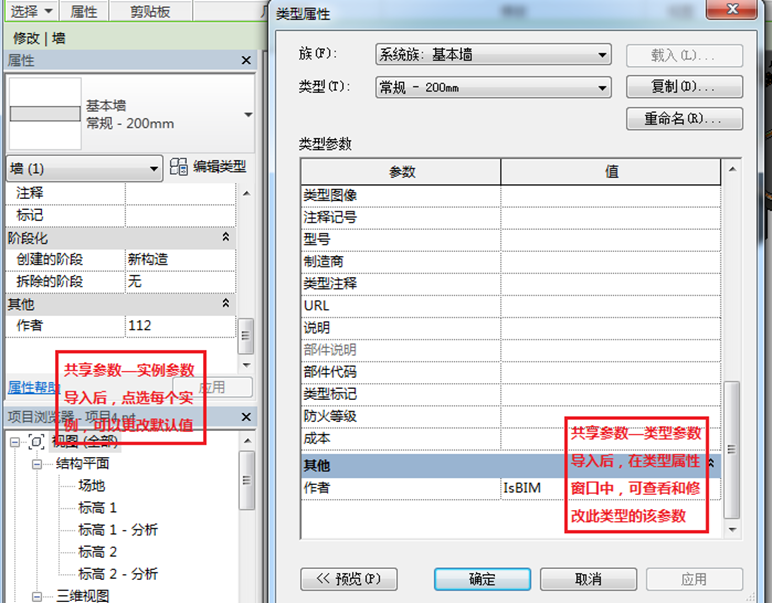

2) 族参数
   
   选择“族参数”，参数类型根据需要可选择“实例参数”或者“类型参数”，打开模板“族参数”，弹出程序内置的Excel数据格式模板。

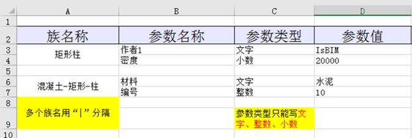

按照模板样式，更改需要添加的属性参数。

当多个族需要添加同样的参数名称时，可按照表格中A3单元格的样式，添加竖线分割。

当一个族需要添加多个参数名称时，可按照表格中A5、A6样式，合并单元格。

参数类型只能写“文字”、“整数”、“小数”。

“参数值”需与“参数类型”匹配。

修改好Excel之后，文件另存至其他位置，以免影响系统模板。

点击导入Excel后面的“…”按钮，浏览找到刚才另存的Excel文件。（此Excel文件不可处于打开状态）

点击“确定”按钮，完成操作。

注：添加族参数的族必须是可以编辑的族，如“基本墙”等不可以添加族参数。

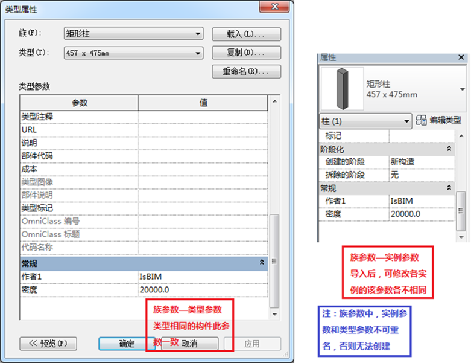

### 增加族参数、修改族参数、删除族参数

1) 增加族参数

运行添加族参数命令，弹出“添加参数”对话框。

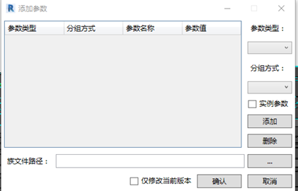

在窗口右侧可通过下拉列表，选择“参数类型”及“分组方式”。如选择“参数类型”为“文字”，“分组方式”为“常规”。点击“添加”按钮，在左侧表格中出现一行族参数信息。

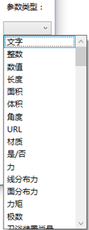

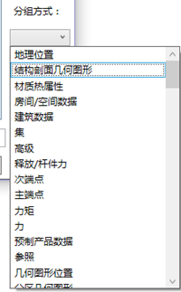

点击左侧表格中“参数名称”一栏，输入与“参数类型”相匹配的参数名称，如输入“地址”；在“参数值”单元格输入“上海”。这样就定义好了一条族参数信息。可按照上述步骤添加多条族参数信息。

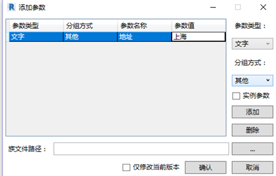

点击“…”按钮，浏览到族文件存放的文件夹，点击“确认”，则文件夹下的所有族文件均添加上述定义好的族参数信息。

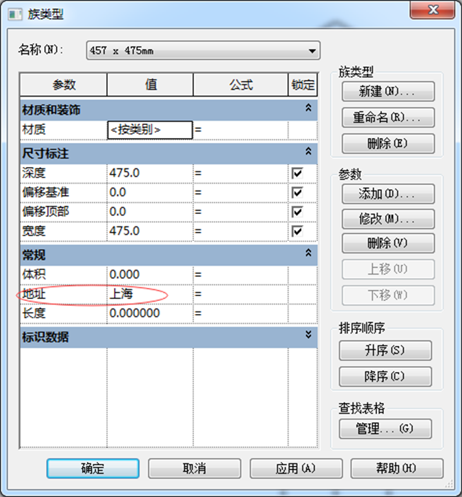

若勾选“实例参数”，则定义的族参数信息，将以“实例参数”形式存入族文件中。

注：若族文件中已经存在要添加的“参数名称”，将忽略此条族参数信息的添加，“参数值”保持为原值不变。第二章EXCEL快速创建类型

2) 修改族参数

运行修改族参数命令，弹出“修改设置”对话框。

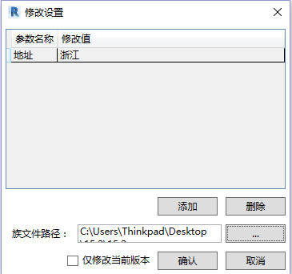

点击“添加”增加一条修改信息

输入要修改的参数名称，例如“地址”

输入要修改成的值，例如“浙江”

点击“…”浏览指定族文件的存放路径

单击“确认”，程序自动完成指定文件夹下所有族的族参数修改。

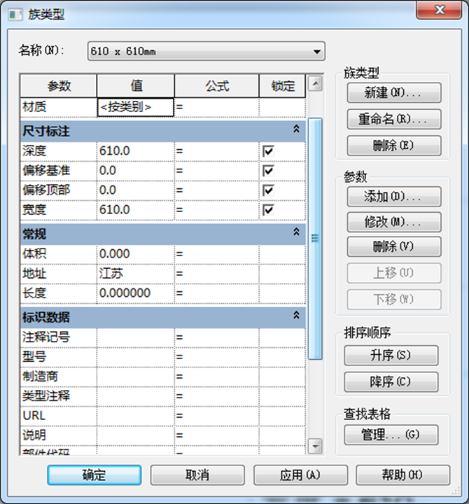

3) 删除族参数

运行删除族参数命令，弹出“参数删除”对话框。

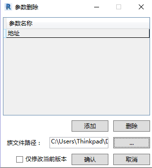

点击“添加”按钮，“参数名称”栏增加一行

点击此空白行，输入要删除的族参数，例如“地址”，

点击“…”浏览指定族文件的存放路径

点击“确认”，则此文件夹下所有的族，均删除表中所列的参数名称

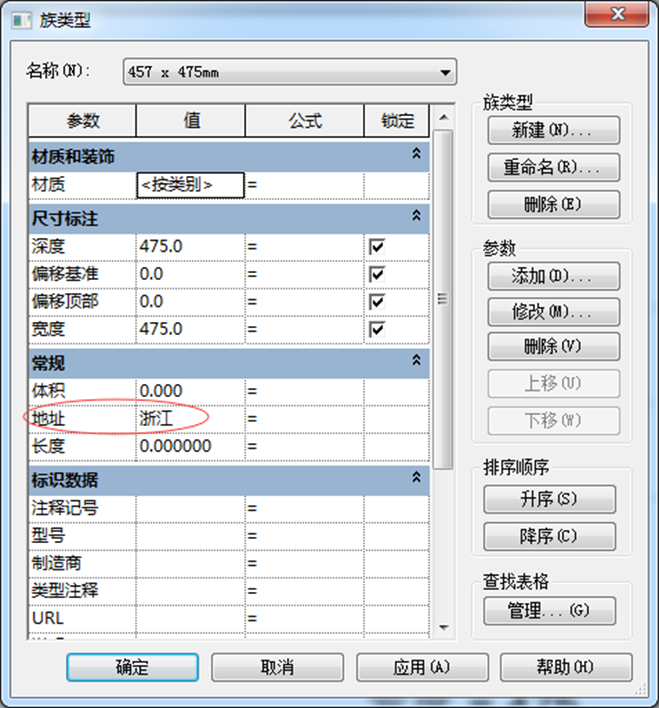

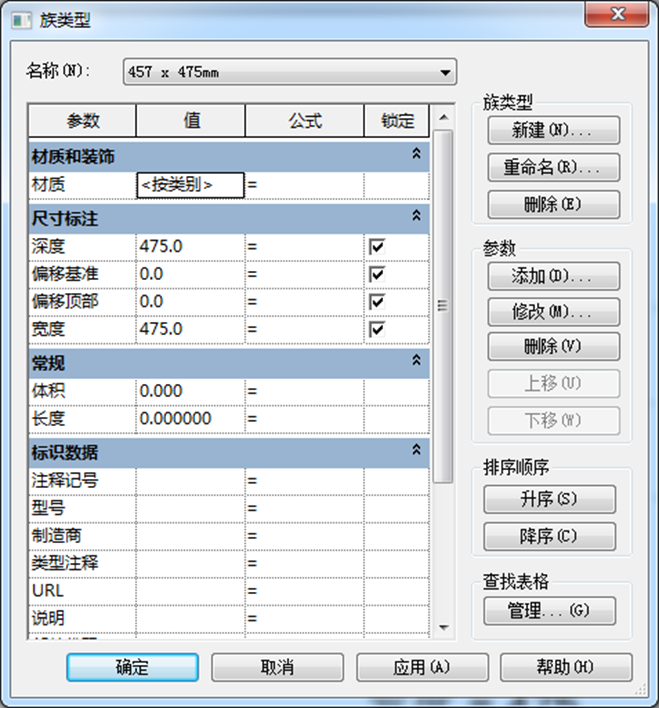

## 分析工具

### 净空分析

1) 净空分析

选择净空分析选项卡，设置净空分析参数，需要注意的是楼板上下必须存在，否则无法分析。

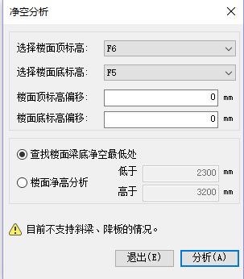

选择好分析楼面后选择分析选项，得到如下图。可以勾选需要忽略的分析构件，重新分析。分析完毕后点击某个构件名称，模型自动查找到对应构件，同时其他构件自动虚化。

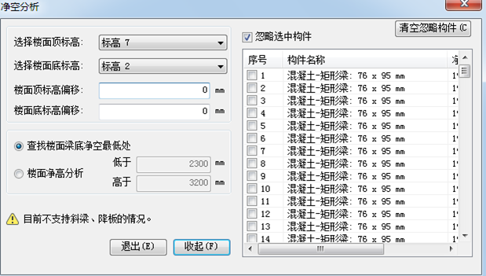

2) 选择分析

单击选择分析选项卡，通过选择构件，设置分析参数。选择好分析楼面后选择分析选项，得到如下图。可以勾选需要忽略的分析构件，重新分析。分析完毕后点击某个构件名称，模型自动查找到对应构件，同时其他构件自动虚化。

### 干涉检查

干涉检查自动识别模型中的族类别。如下图所示

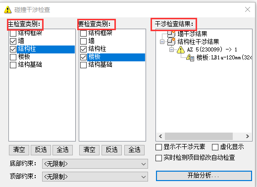

分析的是要检查类别的各个构件和主检查类别是否碰撞，如上图干涉检查结果显示碰撞结果。双击黄色小三角Revit将自动跳转到碰撞部位。

约束条件选择检查的空间范围。也可以通过选择显示不干涉元素实现显示不干涉元素检查结果，以及虚化显示。

## 力学分析接口

### 节点合并

通过单击“节点合并”按钮，可以手动选择需要合并的节点使之合并到一起。

### 干涉检查

通过单击“节点检查”按钮，系统会对当前界面所有节点进行检查，之后会弹出如下界面，可以点击“全文节点”，它会通过最大间距与最小间距的条件对当前所有节点进行检查，也可以指定节点进行检查。点击“合并”按钮对当前分析出来的节点进行合并。

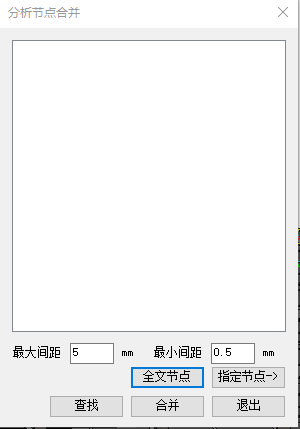

点击“合并”按钮对当前分析出来的节点进行合并。

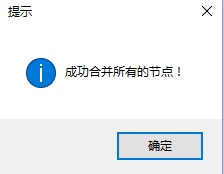

### 三维轴线

点击“三维轴线”按钮，系统自动把二维轴线生成三维轴线，注意：这里必须要先有二维轴线作为基础才能生成三维轴线。

## 通用

### 标高管理

在弹出的“标高管理”对话框中，选择添加标高起始楼层，在右侧的“添加选项”框中输入添加标高的相关信息，点击“确定”按钮。

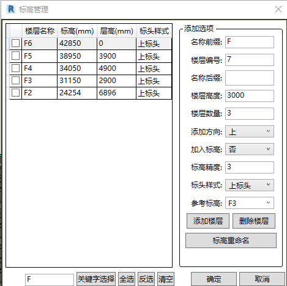

操作完成后，在所选楼层上添加设定的标高。

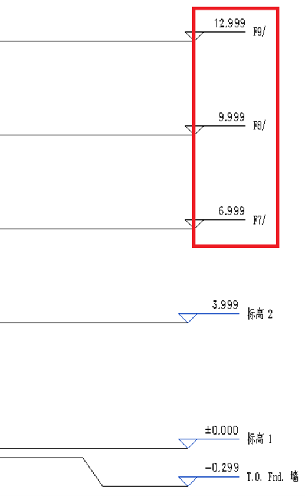

在“标高管理”对话框中，可以在楼层列表中选中楼层，点击“删除楼层”按钮将所选楼层删除。

注意：

添加楼层时起始楼层为当前选中楼层，所以不建议手动输入

添加方向决定向上或向下添加楼层。

加入标高可以在楼层旁注明标高。

### 构件快搜

单击“构件快搜”按钮，会弹出的“族浏览器”对话框，在族浏览器中可快速搜索你想要的选择的构件。它分为“分类模式”和“视图模式”。

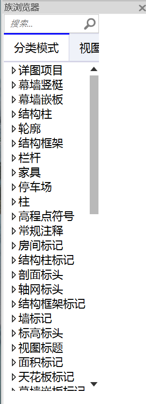

## 其他

### 八局快模工具箱

单击“八局快速工具箱”按钮，会弹出的如下界面，我们可以在界面中选择自己想要建立的快速工具栏。

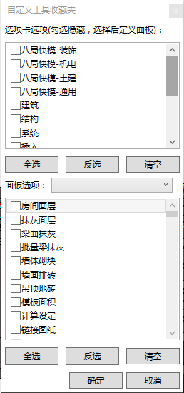

# 土建模块

## 快速建模工具

### 表格拾取

读取导入进来的门窗表、梁柱表等图纸分解后的表格数据，自动导入到Excel文件中。

在“八局快摸-土建”选项卡面板的“快速建模”区域选择点击“表格拾取”图标。

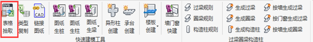

在绘图区选择表格数据（表格线和文字），点击“完成”按钮，在弹出的“选择Excel文件的存放路径”对话框中选择导入目录，点击“保存”按钮，将表格数据导出。

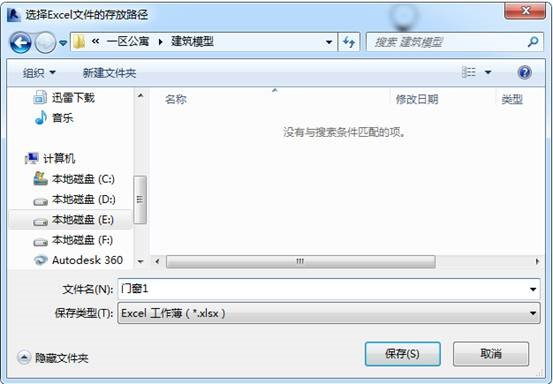

下图展示了一个从一个DWG图纸转成Excel的结果显示：

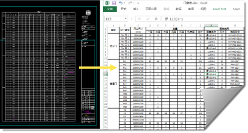

### 类型复制

用户可以导入Excel文件数据，在Revit中创建与数据一致的类型。目前可支持梁柱门窗等类型的快速创建。

在面板按钮中点击“类型复制”图标。

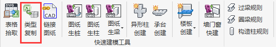

在弹出的“类型复制”对话框中选择要创建类型所属的类别和族等信息，点击“选择”按钮，指定导入Excel文件；

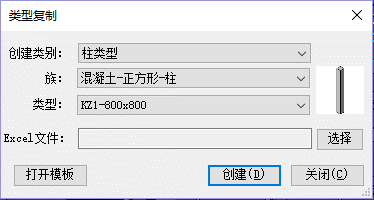

类型创建完成后，会弹出成功创建信息。

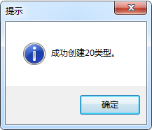

### 链接图纸

单击“链接图纸”按钮，会弹出以下界面，我们可以选择dwg文件，需要注意的是，导入单位设为“毫米”，定位设为“原点到原点”。

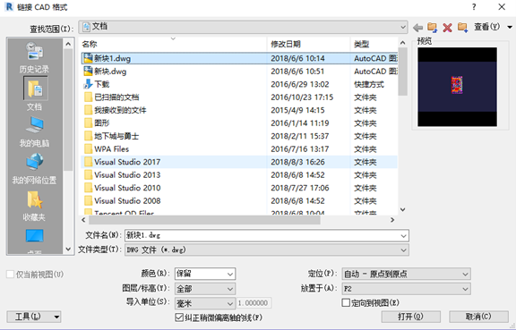

### 图纸编辑

点击图纸编辑，弹出以下对话框。

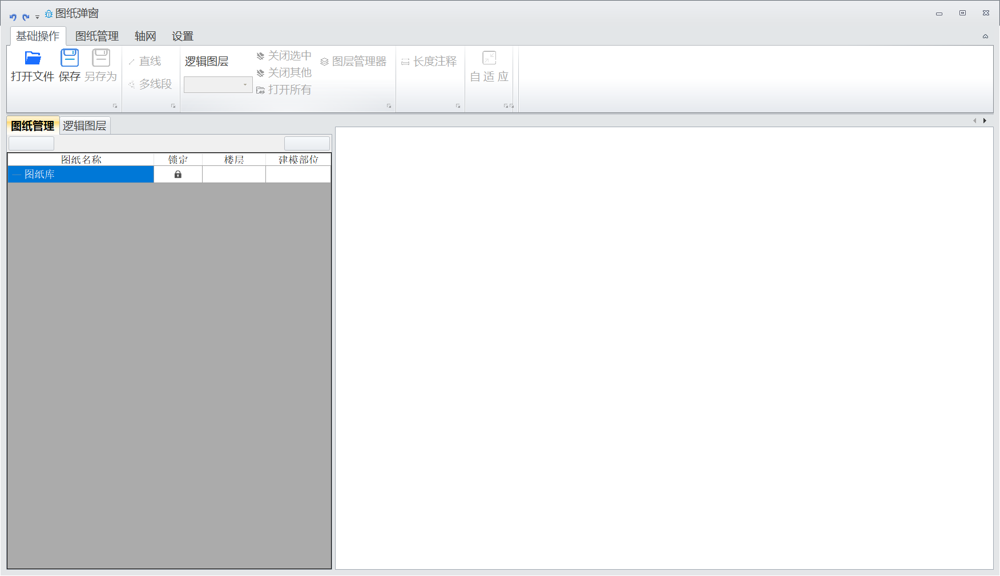

点击图纸管理标题栏下，添加图纸按钮，弹出打开对话框，选择一张图纸。

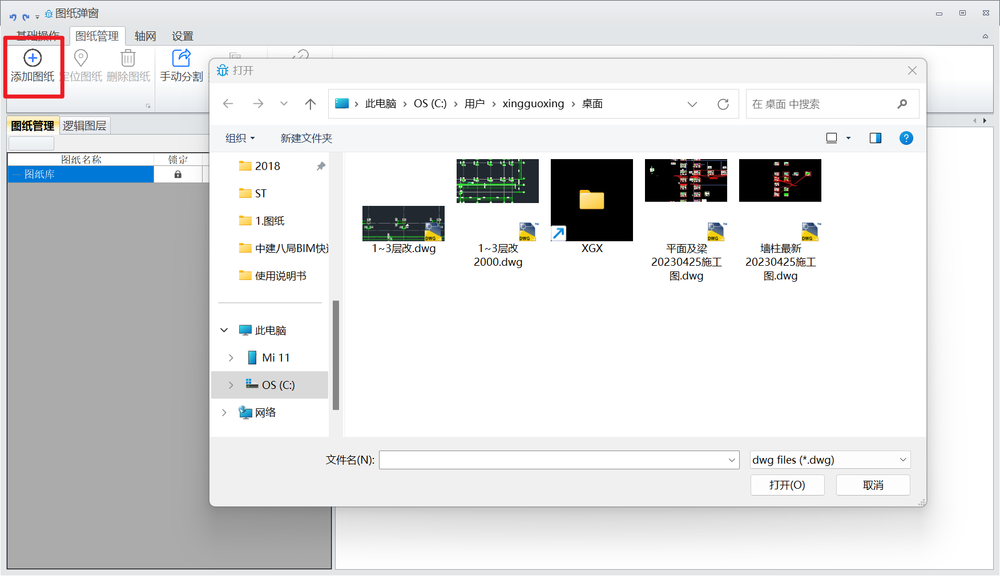

点击手动分割按钮，手动框选部分图纸

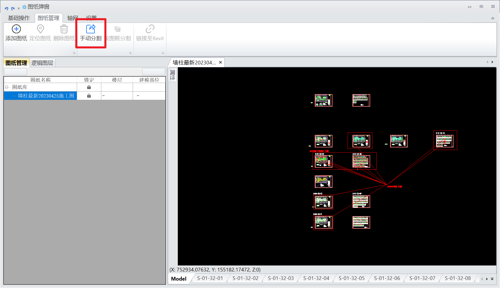

框选后弹出对话框，选择放置楼层及命名图纸。

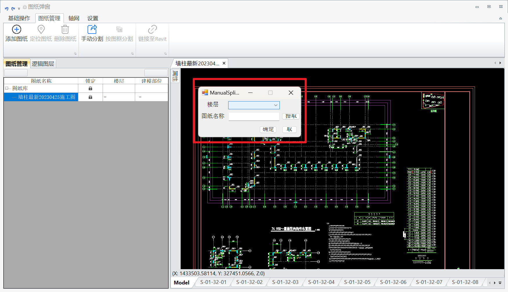

点击逻辑图层下导入清单按钮，导入模型任务清单。

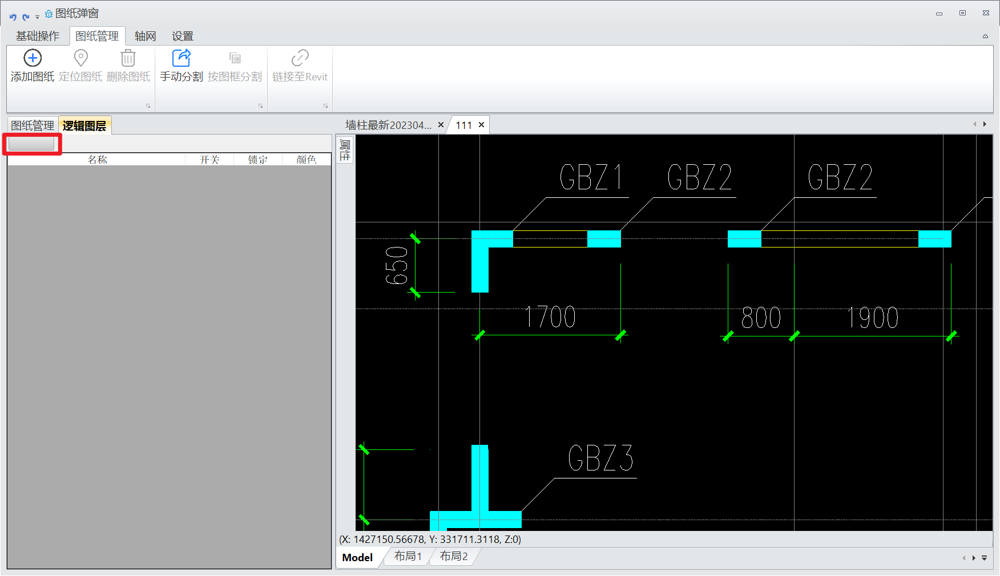

在导入的模型任务清单上，在柱模型构件任务上，右键单击，弹出任务栏，单击提取按钮。

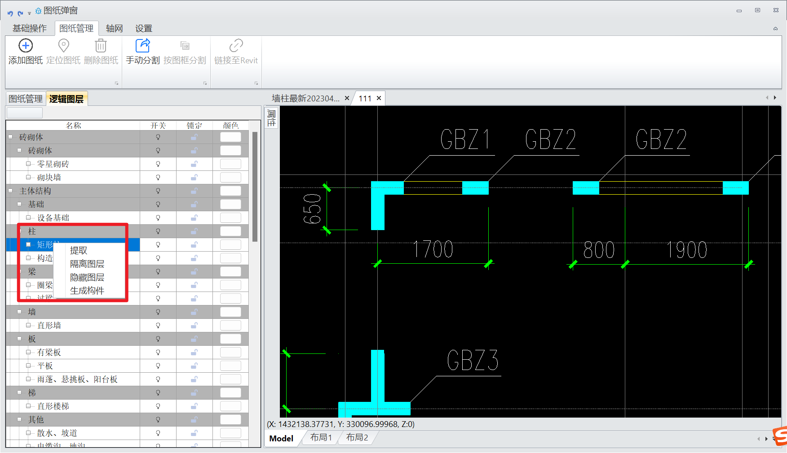

弹出对话框，点击拾取柱边线按钮，在图纸上鼠标左键选择柱边线图层，右键单击将图层选中至逻辑图层。

单击拾取柱标注按钮，在图纸上鼠标左键选择柱标注图层，右键单击将图层选中至逻辑图层。

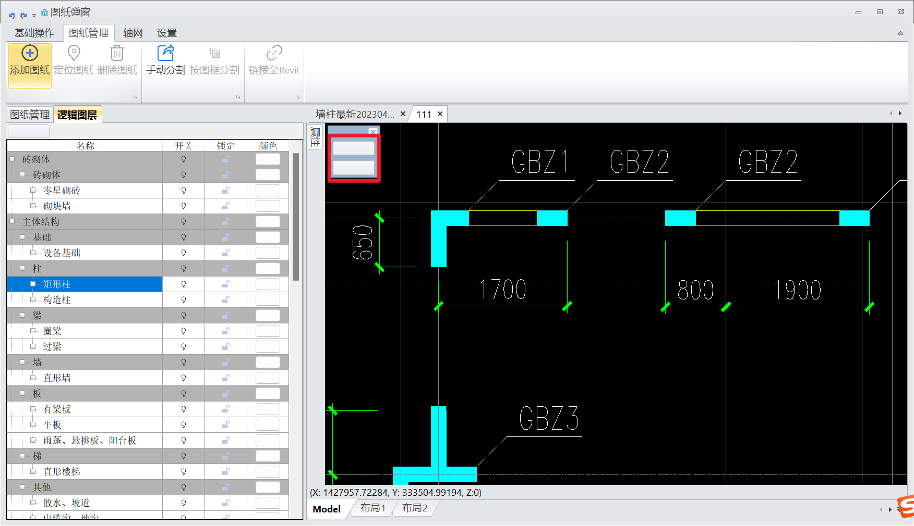

在柱模型构件任务上，右键单击，弹出任务栏，单击隔离图层按钮，切换至隔离图层窗口。

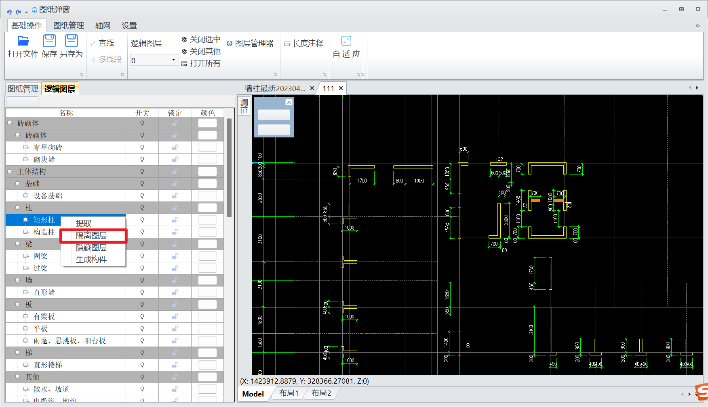

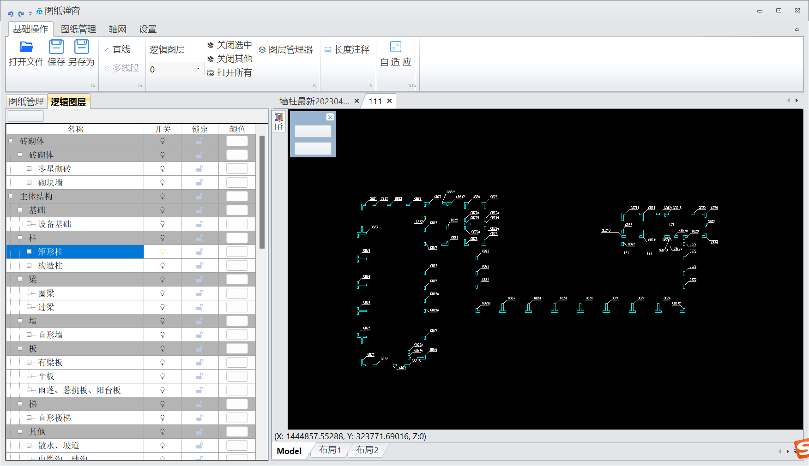

在柱模型构件任务上，右键单击，弹出任务栏，单击生成构件按钮，自动生成柱构件。

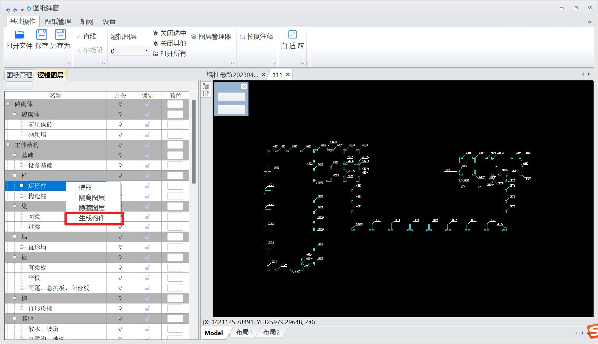

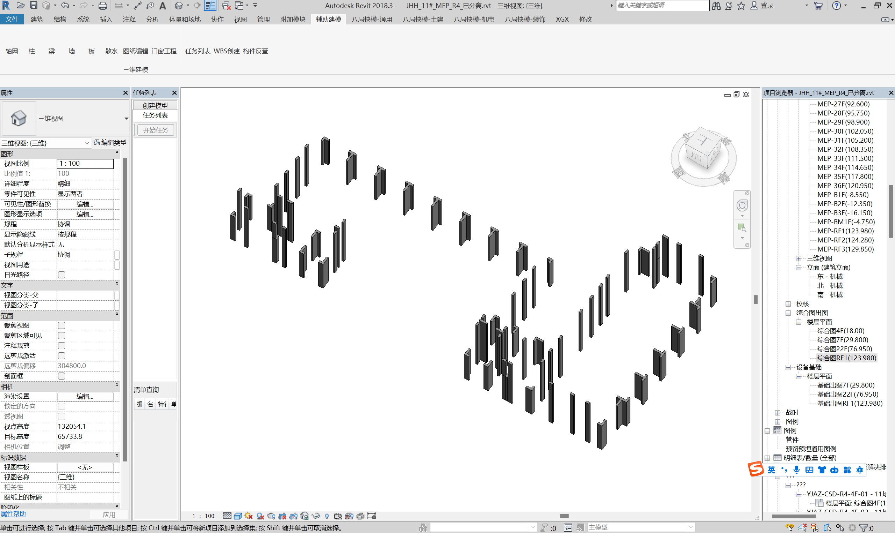

在墙模型构件任务栏上，右键单击，与柱构件生成方式相同，生成墙构件。

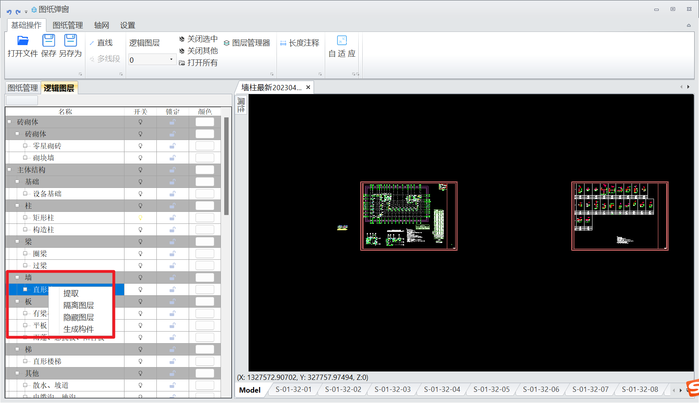

### 多图翻模

单击土建模块下的“多图翻模”按钮，会弹出以下界面。点击“浏览”选择链接或导入各构件图纸。土建模块下的“多图翻模”功能支持柱、梁、桩图纸一键翻模。点击“下一步”。

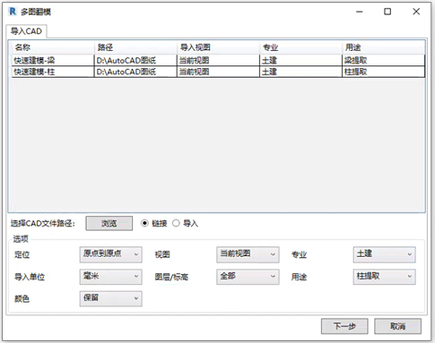

用户需要在已链接或导入的图纸中选取对应的柱，或梁，或桩图层，再点击“下一步”。

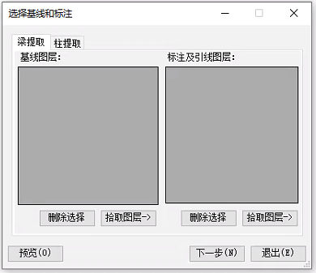

在创建参数视窗中，为柱，或梁，或桩，进行参数设置，点击“创建”。

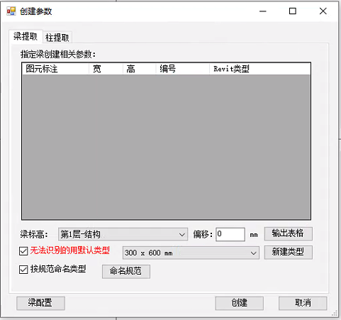

程序将依照图纸，自动创建对应的柱梁桩。相较单张图纸的翻模功能，多图翻模功能，能够同时为多张同专业的图纸进行翻模。

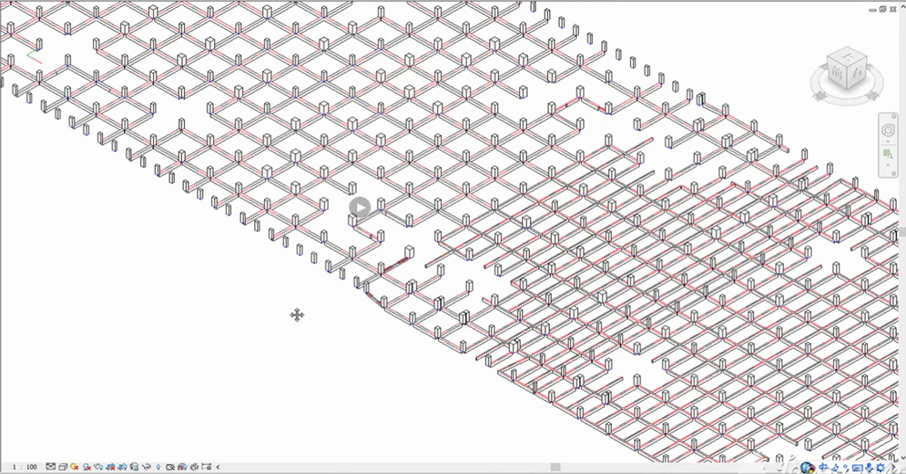

### 图纸生桩

桩的自动创建首先选择桩所对应的dwg图层，本例选择柱图层，然后是桩放置的标高。预览图层功能如上文所述。桩长深度，是从桩标高开始向下延伸计算。

通过三维视图选项，三维的可见性/图形替换，通过点击线信息栏，可以完成替换，实现重新对线的参数的设置，如下图所示。

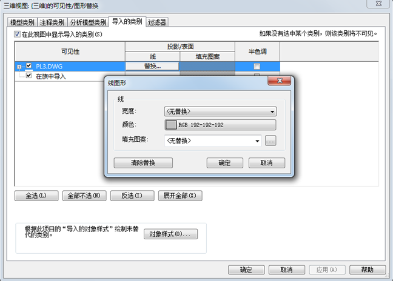

### 图纸生柱

导入链接CAD之后，为保证能够准确读取图纸请先保存文档，点击“图纸生柱”弹出对话框。

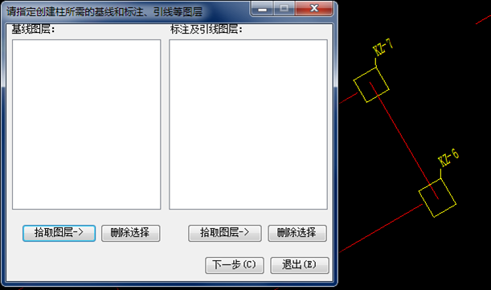

该对话框提供了以下功能：

1.可以允许用户选择柱对应的”基线图层”及”标注及引线图层”：点击”基线图层” , ”拾取图层”将暂时关闭该对话框进入Revit交互界面，提示用户选择任何一条线，该条线所在的图层的所有线都将作为柱的基线；点击”标注及引线图层” ,“拾取图层”将暂时关闭该对话框并进入Revit交互界面，提示用户选择标注和引线的图层。注意到，选择后的图层将自动被关闭，方便用户查看是否还有遗漏的图层没有添加。

2.选择的图层将自动加到该界面上，工具将从这些选择的图层中读取相关的基线、文字等数据进行相关的算法读取和文字解析及匹配。

3.选择后可以通过勾选或取消勾选来预览选择的图层；也可以将不需要的图层从界面中删除掉。

4.选择完图层后点击”下一步”将进行柱基线和文字的读取、解析和匹配；弹出以下对话框：

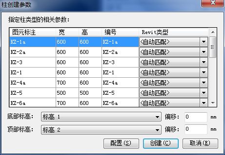

在这个对话框上显示了读取到的图元标注及自动计算的相的尺寸信息，默认情况下将按”<自动匹配>”的模式进行创建：界面指定的宽、高尺寸将决定具体的柱的尺寸信息。

另外，也可以自定义指定Revit类型，这样该类型的柱子将按照指定的柱类型进行创建，此时将不再允许用户指定宽和高的参数：

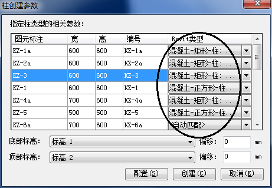

在创建构件时候，也许用用户指定该类构件的编号，这样创建的实例将根据匹配的标注进行自动编号：构件创建完成后。

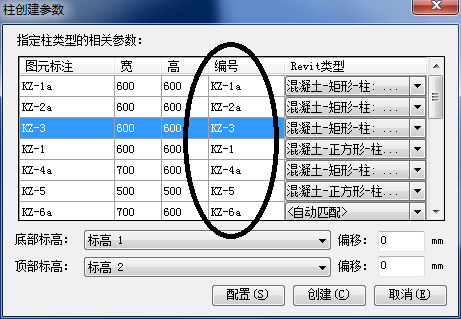

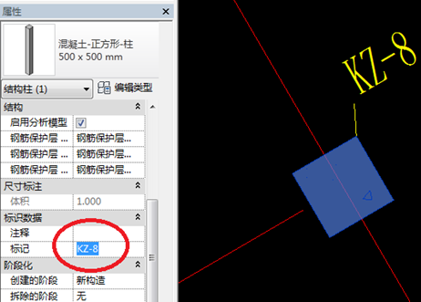

1.在创建过程中，工具不仅仅能识别普通的矩形柱，同时也支持正六边形柱和正八边形柱的识别和创建，下图显示了一个创建前后的效果图。

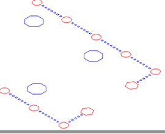

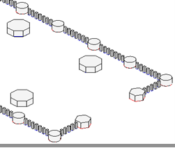

2.在创建过程中如果会检查当前项目中是否存在所需的柱的尺寸类型，如果没有，程序会自动创建柱的类型。

3.对没有识别成功的dwg图元，在Revit中用醒目的高亮线标记出来，该高亮线的颜色和宽度可以通过“配置”进行设置。下面图创建结果的信息提示以及未能成功创建的。

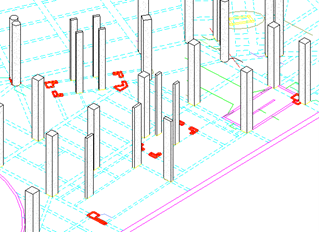

### 图纸生梁

1) 图纸生梁

梁的自动创建相对柱子的自动创建要复杂。首先也是选择梁对应的dwg图层，该图层有两类：一类是梁的基线图层，另外一类是集中标注、原位标注及引线图层；然后是梁放置的标高。预览图层功能如上文所述。最后是设置梁的约束条件，该工具平台也给出了缺省设置。

运行命令后，弹出下面的对话框，允许用户选择“基线图层”和”标注及引线图层”，选择后用户可以通过勾选和取消勾选来进行图层的预览和查看：

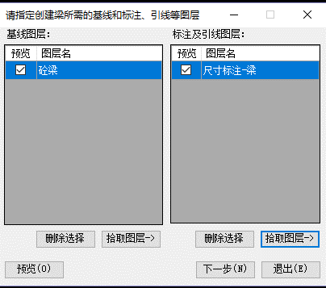

图层的类别和信息设定，进行相关尺寸和信息的匹配、设定：

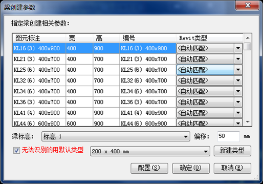

为了正确识别和创建梁和避免图纸的错误造成的模型创建错误，在读取DWG图纸时需要对图纸中的数据进行一定的约束，点击”配置”可以设置相关的约束条件各项条件描述：

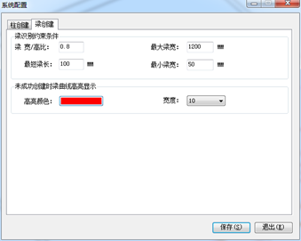

1）梁高/梁宽比：由于梁的高度在dwg图纸中识别困难，梁的高度的确定由高宽比和梁宽来决定。如果图纸中一些梁不符合该高宽比，由建模人员在Revit中利用后处理工具人工交互完成。

2）最大梁宽：约定梁的宽度超过一定数值，就不识别为梁。

3）最短梁长：约定梁的长度小于一定数值，就不识别为梁。主要是避免一些零星线造成的图纸错误。

4）最小梁宽：约定梁的宽度小于一定数值，就不识别为梁。

2) 拾线生梁

通过点击“拾线生梁”按钮，对cad图纸进行梁的线段拾取。拾取完之后点击“完成”，会弹出如下窗口，之后对梁进行条件约束，单击“确定”按钮即可生成。

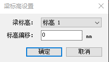

### 异形柱创建

异形柱的自动创建跟柱子的自动创建差不多。首先也是选择异形柱对应的dwg图层，该图层有两类：一类是柱子的边线拾取，另外一类是异形柱的名称拾取。最后是设置异形柱的约束条件。同时可以设置是否将圆柱设置为异形柱。

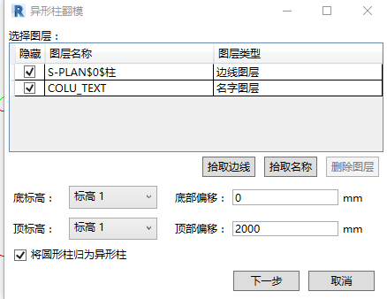

运行命令后，选择“下一步”，弹出下面的“匹配结果”对话框，需要用户对异形柱名称进行命名。之后可以点击“创建”按钮进行创建。

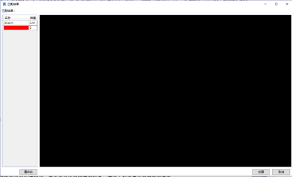

### 承台创建

承台的自动创建相对异形柱的创建要复杂。首先也是选择承台对应的dwg图层，该图层有三类：一类是承台的边线拾取，第二类是承台的标高拾取，第三类是名称拾取。最后是设置承台的约束条件。

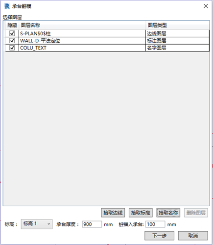

运行命令后，选择“下一步”，弹出下面的“匹配结果”对话框，需要用户对异形柱名称进行命名。之后可以点击“创建”按钮进行创建。

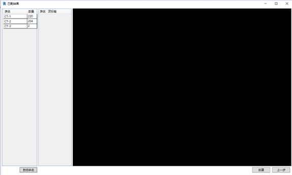

### 楼板的快速创建

1) 楼板创建

楼板的自动创建相对，首先也是选择放置的标高。通过下拉菜单选择楼板的类型。

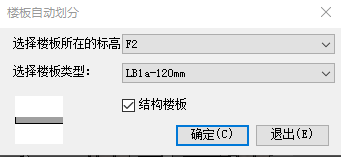

需要注意的是楼板创建必须在柱，梁，墙创建完成后才可以创建，否则会出现如图所示错误，因为模型边界不连续。

2) 选择创建

楼板的选择创建，通过单击这个按钮，之后对需要生成楼板的构件进行选择进而创建楼板。选择完后点击“完成”按钮，会弹出跟“楼板创建”一样的界面。单击“确定”按钮就能生成楼板。

3) 拾线创建

楼板的拾线创建，通过单击这个按钮，之后对需要生成楼板的边界线段进行拾取进而创建楼板。选择完后点击“完成”按钮，会弹出跟“楼板创建”一样的界面。单击“确定”按钮就能生成楼板。

### 墙门窗快建

门窗识别要求，如下表所示。

 **表 门窗识别要求**

 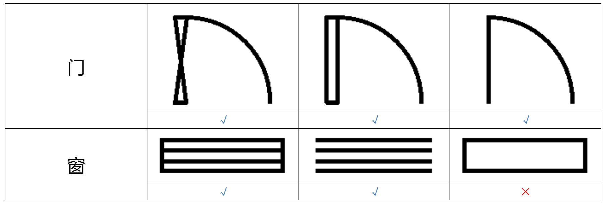

操作说明

1) 墙门窗翻模

首先新建Revit文档，选择“建筑模板”，在界面上方选择“插入”工具栏，点击“链接CAD”将需要翻模的CAD图纸导入到当前文档，按Ctrl+S保存当前文档。

点击“图纸生墙”按钮，并点击当前Revit文档中的CAD图纸，弹出“墙快速创建”窗体。

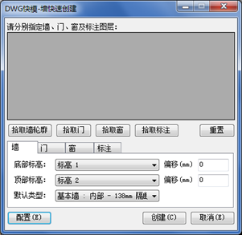

点击“拾取墙轮廓”按钮，从图纸中找出墙对应的图层进行点选。图层选择成功后，在Revit中会被隐藏。可在窗体中通过取消图层的“预览”项对勾，对图层进行恢复显示。

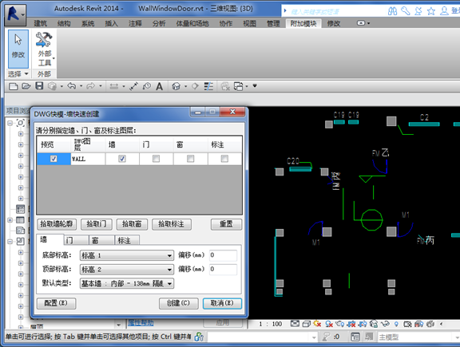

按照同样的方式，分别点“拾取门”、“拾取窗”、“拾取标注”按钮，将门窗及标注的对应图层进行选取。若有错选的图层，可在窗体的图层表格中，通过勾选各图层的类别项进行矫正，也可双击图层名对其进行删除。

之后，分别在窗体下部“墙”、 “门”、 “窗”、 “标注”选项卡中设置相应的缺省创建类型、标高及标注识别规则等基本参数，如图所示。

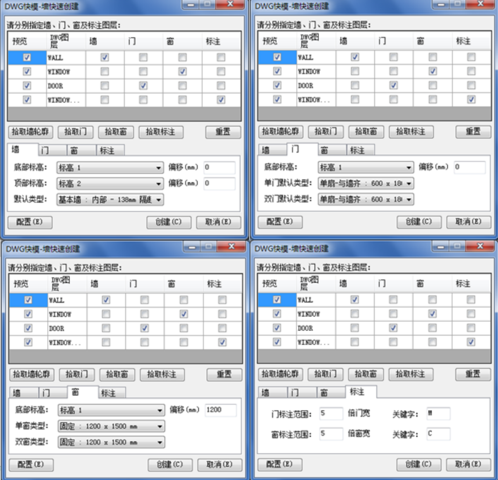

在建模前应点击窗体左下角的“配置”按钮，对墙创建的基本尺寸参数进行配置，如图所示。

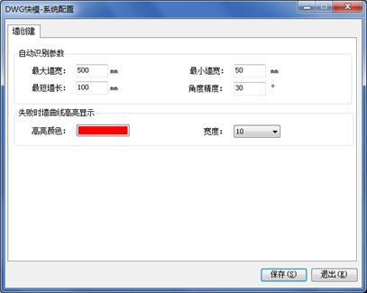

配置完毕后，点击“创建”按钮，进行窗门窗的识别。

识别完成后，将弹出“创建参数”窗口，以对识别得到的模型信息进行汇总，并对墙、门、窗的类型进行细化选择，如图所示。

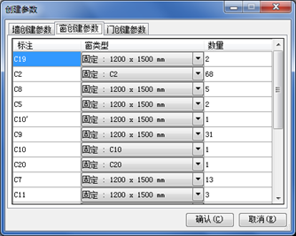

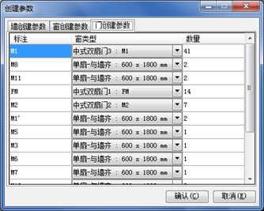

对于不想创建的墙，可在对应行右击其墙宽标识，进行删除操作。

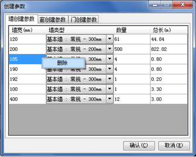

编辑完成后，点“确认按钮”，即可对当前图纸中识别到的模型信息在Revit中进行3D建模。最终得到的结果如下图所示。

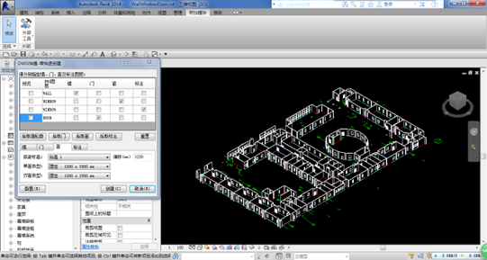

## 过梁圈梁构造柱

### 过梁规则、圈梁规则、构造柱规则

1) 过梁规则

运行命令，选择“过梁规则”选项板，点击“添加”按钮，将会弹出“过梁规则”对话框，在“过梁规则”对话框中输入生成过梁的墙体厚度、洞口宽带、过梁高度和单挑长度等设置信息，点击“确定”按钮，完成过梁规则定义。

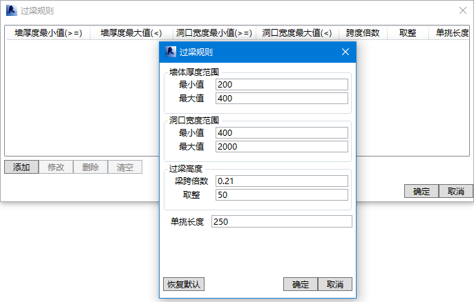

2) 圈梁规则

运行命令，选择“圈梁规则”选项板，点击“添加”按钮，将会弹出“圈梁规则”对话框，在“圈梁规则”对话框中输入生成圈梁的墙体厚度、布置方式和圈梁高度等设置信息，点击“确定”按钮，完成圈梁规则定义。

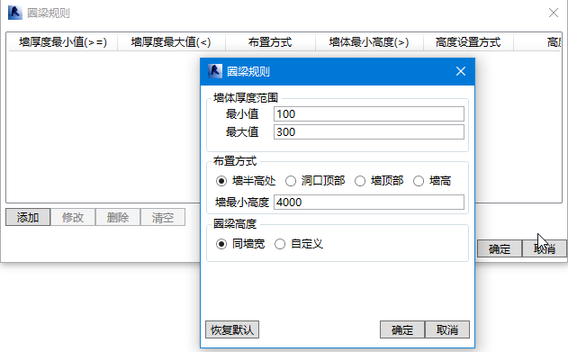

3) 构造柱规则

运行命令，选择“构造柱规则”选项板，点击“添加”按钮，将会弹出“构造柱规则”对话框，在“构造柱规则”对话框中输入生成构造柱的墙体厚度和布置方式的相关设置信息，点击“确定”按钮，完成构造柱规则定义。

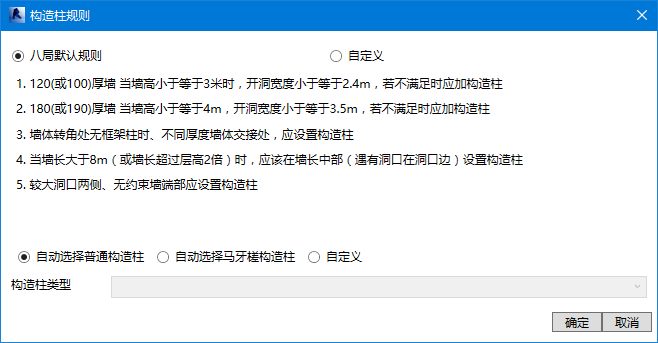

### 生成过梁、生成圈梁、生成构造柱

1) 生成过梁

在弹出的“选择楼层”对话框中，选择标高，点击“确定”按钮。

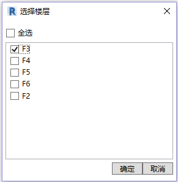

生成过梁操作完成后，弹出“结果”提示框，显示生成的过梁实例信息，点击“关闭”按钮关闭提示框，如下图所示。

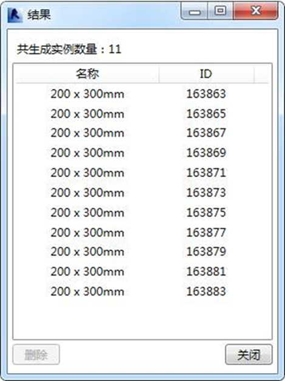

可以在绘图区看到所有门和窗都添加了过梁。

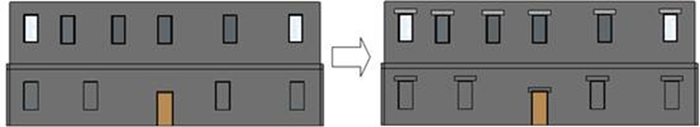

2) 生成圈梁

在弹出的“选择楼层”对话框中，选择标高，点击“确定”按钮。

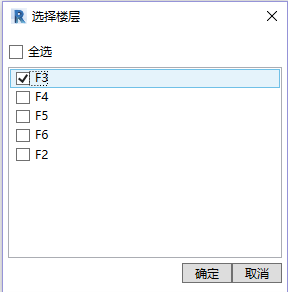

添加圈梁操作完成后，弹出“结果”提示框，显示添加圈梁实例详细信息，点击“关闭”按钮关闭提示框。

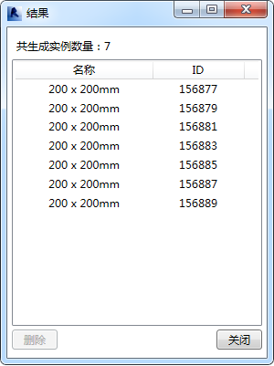

可以在绘图区看到墙的顶端都添加了圈梁。

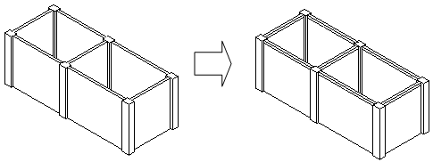

3) 生成构造柱

在弹出的“选择楼层”对话款，选择标高，点击“确定”按钮。

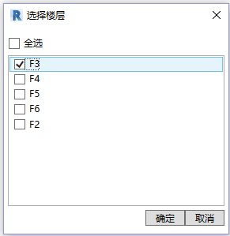

添加构造柱操作完成后，弹出“结果”提示框，显示添加构造柱实例详细信息，点击“关闭”按钮关闭提示框。

可以在绘图区看到墙的相交处都添加了构造柱。

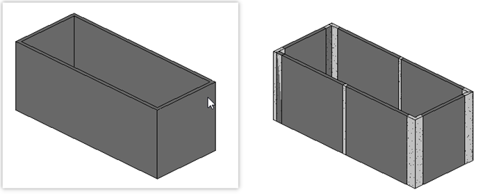

### 按墙生成过梁、按门窗生成过梁、按墙生成圈梁

1) 按墙生成过梁

在按墙生成过梁之前，首先得对过梁定义规则，之后点击“按墙生成过梁”按钮，在模型里面选择墙，之后点击“完成”按钮。

2) 按门窗生成过梁

在按墙生成过梁之前，首先得对过梁定义规则，之后点击“按门窗生成过梁”按钮，在模型里面选择门窗，之后点击“完成”按钮。

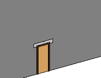

3) 按墙生成圈梁

在按墙生成过梁之前，首先得对圈梁定义规则，之后点击“按墙生成圈梁”按钮，在模型里面选择墙，之后点击“完成”按钮。

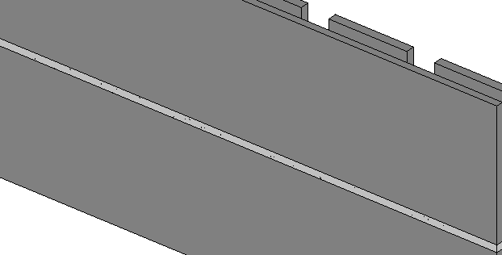

## 智能修改工具

### 柱拆分合并

1) 标高

在绘图区选中需要进行分段的柱子，点击“完成”按钮。

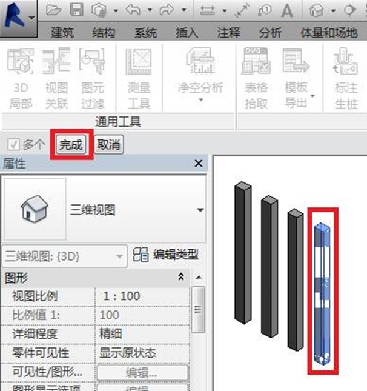

在弹出的“选择用于柱分段的标高”对话框中选择分段标高：

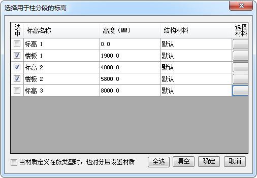

同时也可以按照标高指定每层的结构材质；点击“确定”按钮，进行分段操作。

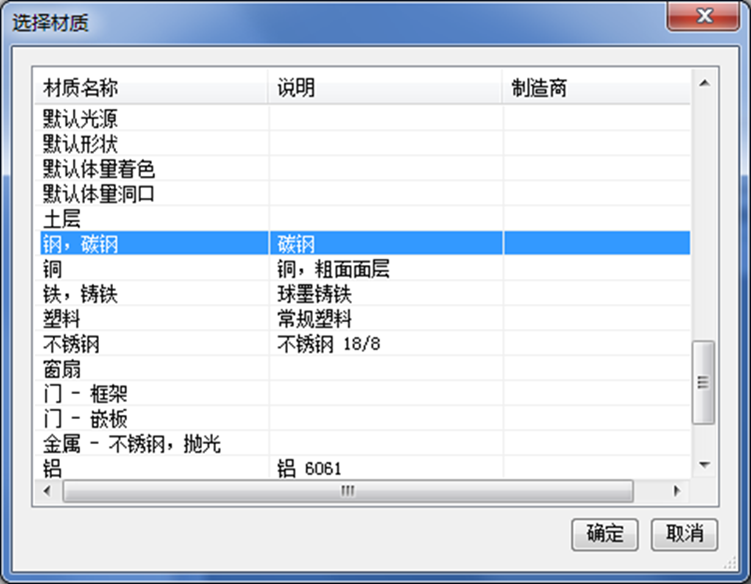

操作完成后，可以在绘图区查看到所选柱已经根据所选标高分成多段，如下图所示。

2) 手动合并

在绘图区选择要合并的柱子（可以选择多根），点击“完成”按钮。

在弹出的“自动并柱”对话框中，选择柱合并后的柱类型，可以是原有类型也可以替换成其他类型，点击“合并”按钮，进行合并操作。

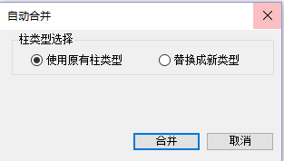

操作完成后，可以在绘图区查看到所选柱子已经合并。

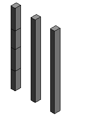

3) 自动合并

点击“自动合并”按钮，会直接弹出以上界面，相对于“手动合并”它不需要手动选择，会对所有柱的类型进行合并。

### 梁拆分合并

1) 梁拆分

在弹出的“选择相交类型”提示框中，选择相交类型，点击“确认”按钮。

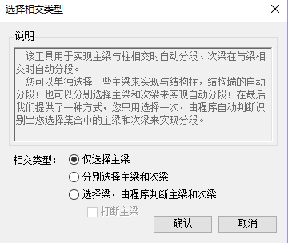

在绘图区选择主梁，点击“完成”按钮。

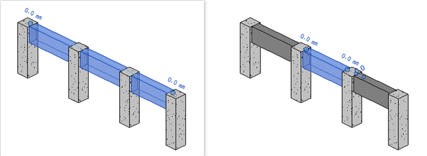

2) 间距拆分

在弹出的“请输入梁的长度”提示框中，输入梁的长度，点击“确认”按钮。之后选择需要拆分的梁，单击“完成”按钮，系统将会自动对梁根据间距进行拆分。

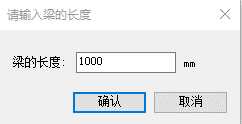

3) 自动合并

在绘图区选择两根梁，两根梁中间有间隙，点击“自动合并”按钮，进行合并操作。

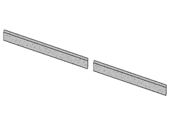

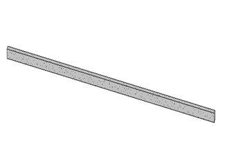

4) 手动合并

在绘图区选择两根梁，两根梁中间有间隙，点击“手动合并”按钮，手动选择两根梁，单机“完成”按钮，也会进行如上合并操作。

5) 共线合并

当三根梁及三根梁以上有重合部分，且在同一条直线上时，点击“共线合并”按钮，手动选择首尾两根梁，单机“完成”按钮，几根梁就变成了一根梁。

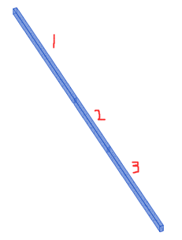

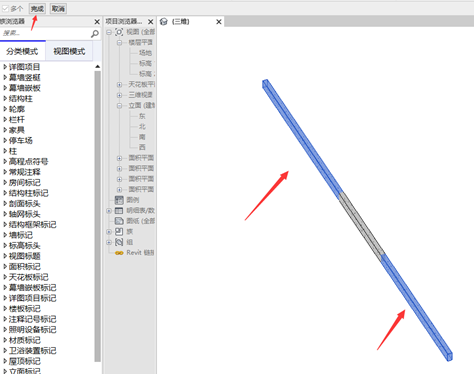

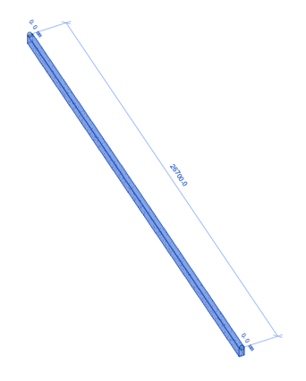

### 楼板拆分

1) 选点拆分

在绘图区，在楼板的边上点击，将生成直角线将楼板拆分，如下图所示。

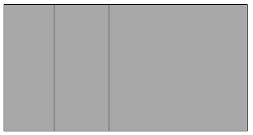

2) 间距拆分

在绘图区，在楼板的边上点击，系统将弹出“分割楼板”窗口，如下图所示。

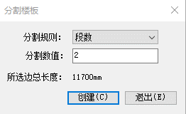

我们可以选择不同的分割规则，包括有“段数”、“固定间距”、“最大间距”、“最小间距”。之后在填写分割数值，点击“创建”按钮，就会对板根据限定条件进行分割。

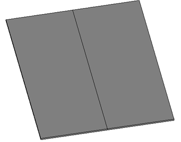

### 后浇带分割

点击后浇带拆分，弹出以下界面

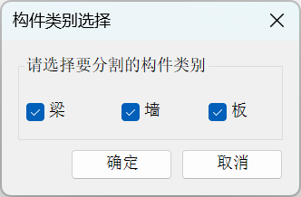

勾选需要分割的构件类别。点击确定，选择要拆分的板、梁或墙模型，点击完成。沿后浇带位置绘制模型线。选择模型线，点击完成，完成模型拆分。

### 墙拆分

1) 标高分墙

然后在绘图区选择需要进行拆分的墙，点击“完成”按钮。

在弹出的“选择用于墙分段的标高”对话框中，选择拆分墙的标高，设置偏移量和剪切缝隙高度，点击“确定”按钮，进行操作。

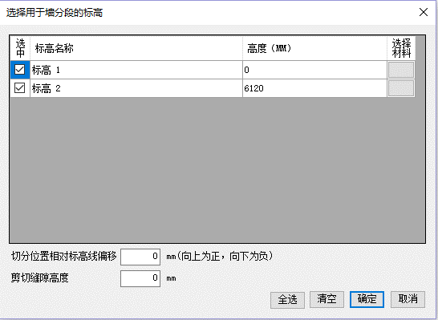

操作完成后，可以在绘图区看到所选墙已经根据标高进行拆分了，如下图所示。

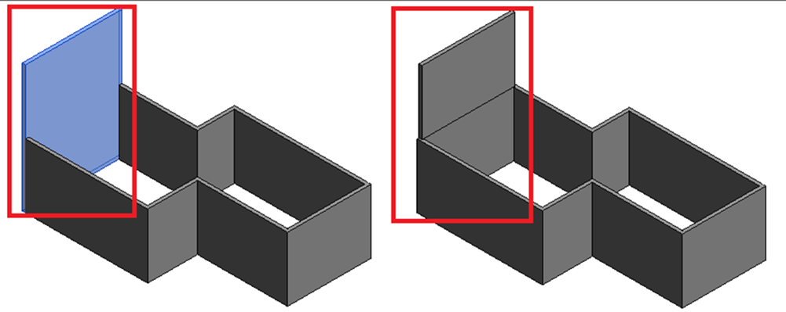

2) 选点分墙

在绘图区需要拆分的墙上任意选择一点，单击，进行拆分操作。

操作完成后，可以在绘图区看到墙根据所选点进行了拆分，如下图所示。

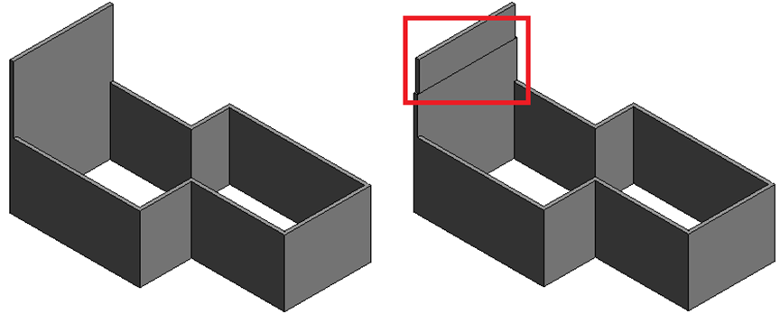

3) 选面分墙

在绘图区选择需要拆分的墙，点击“完成”按钮，再选择一个与墙垂直的平面（这里选择的是楼板，也可以是梁，吊顶等构件的平面），进行拆分。

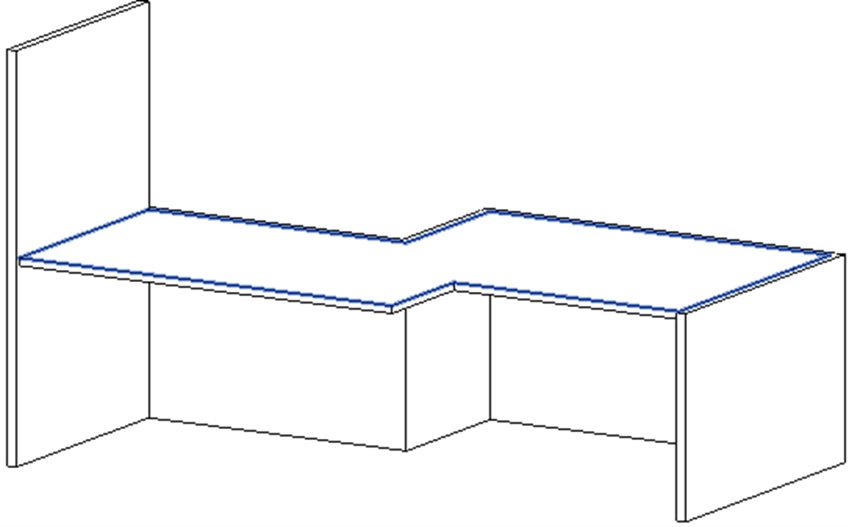

操作完成后，可以看到墙被拆分，拆分点与所选平面一致，如下图所示。

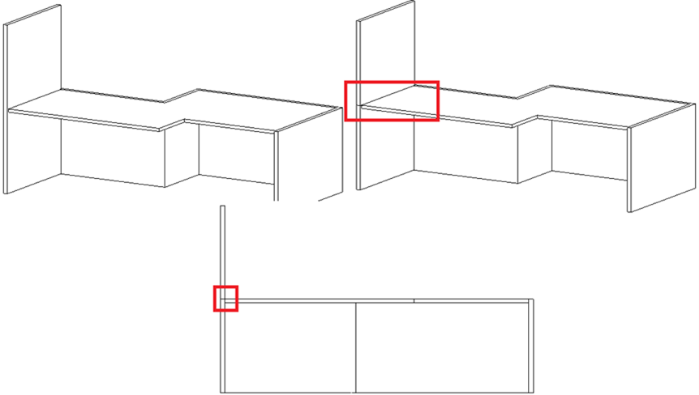

4) 墙合并

单击“墙合并”按钮，会弹出“合并墙”按钮，点击“选择首尾墙”，在绘图区选择需要合并的墙，点击“完成”按钮，墙体就会合并到一起，最后点击“退出”。

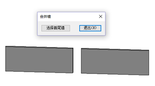

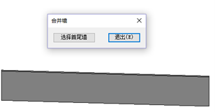

### 编号

1) 柱编号

运行命令，在绘图区选中要添加编号的柱，点击“完成”按钮。如果图元具有重复标记，会弹出警告。

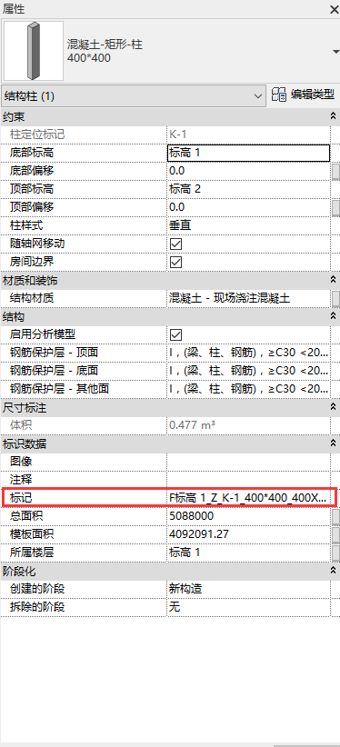

2) 梁编号

运行命令，在绘图区选中要添加编号的梁，点击“完成”按钮。如果图元具有重复标记，会弹出警告。

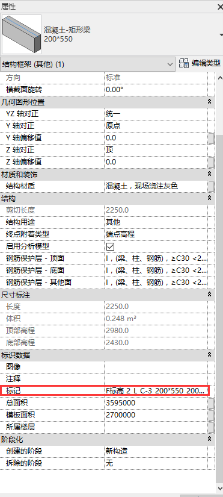

3) 全文编号

运行命令，会弹出如下界面，选择要添加编号的构件类型，单击“确定”按钮，即可对其进行全部标记。如果图元具有重复标记，会弹出警告。

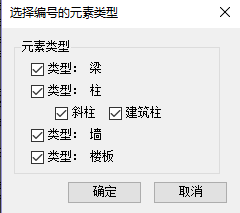

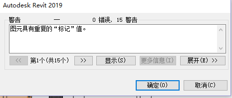

### 墙平梁板顶底

1) 墙平梁板底

运行命令，在绘图区选中需要平梁板的墙，点击“完成”按钮。

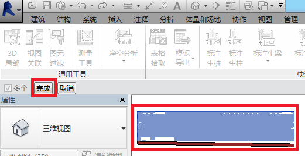

在弹出的“设置预留缝”对话框中输入需要的预留缝值，点击“确定”按钮。

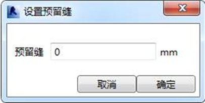

操作完成后，可以在绘图区看到墙与板已经对齐。

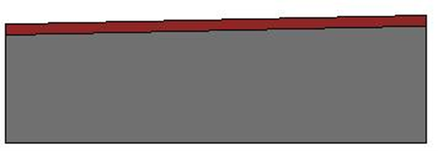

2) 墙平梁板顶

运行命令，在绘图区选中要平梁板的墙，点击“完成”按钮。

 操作完成后，可以在绘图区查看到所选墙已经与板对齐，如下图所示。

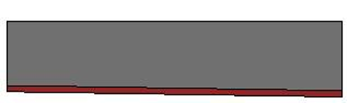

### 梁平板顶底

1) 梁附着板底

运行命令，在绘图区选择楼板和梁，点击“完成”按钮。

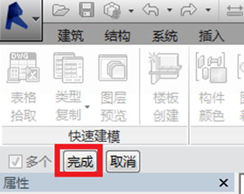

操作完成后，梁的顶端与斜的楼板板底对齐，可以从侧面更好的查看效果。

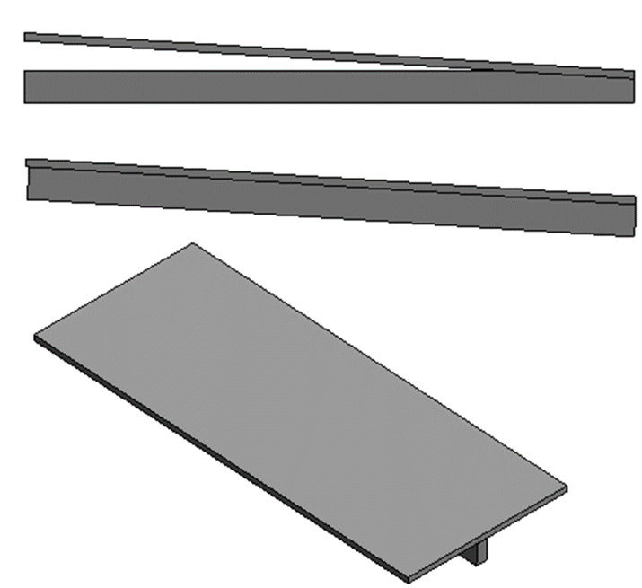

2) 梁附着板顶

运行命令，在绘图区选择楼板和梁，点击“完成”按钮。

操作完成后，梁的顶端与斜的楼板板顶对齐，可以从侧面更好的查看效果。

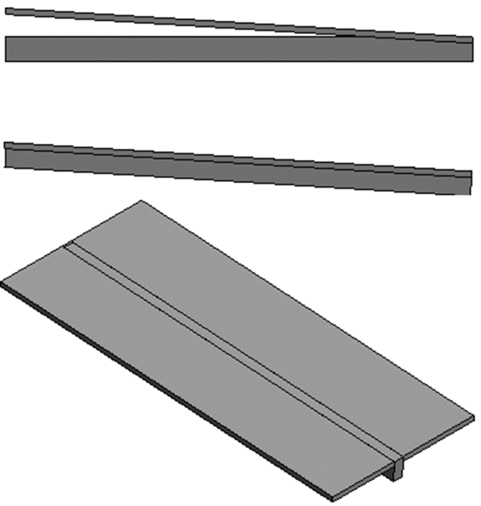

### 一键扣减

运行命令，在弹出的“一键扣减”对话框中选择“快捷剪切”的方式，按构件类别进行剪切，然后选择针对执行的“标高”或者“当前模型”，点击“确定”按钮，进行剪切操作。

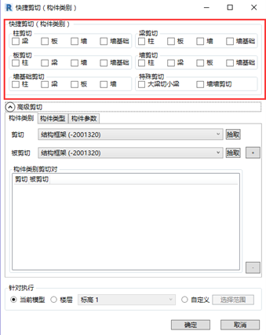

也可以选择“自由定义剪切”，程序自动读入模型中已使用的构件类型，存放于自定义剪切的下拉选择框中。

用户设置好剪切对之后，点击“+”，则此剪切对被加入到“剪切对”列表中，选择针对执行的“标高”或者“当前模型”，点击“确定”按钮。

目前支持“构件类别”、“构件类型”和“构件参数”三种方式进行自定义剪切对。

在“构件类别”选项板中，只对所选构件进行剪切，如下图所示。

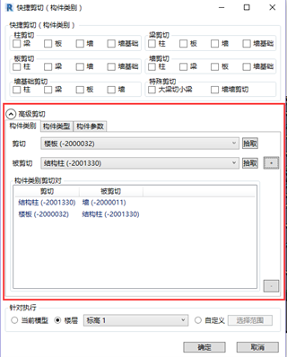

在“构件类型”选项板中，只对所选的构件类别进行剪切，如“400×800” 的矩形梁剪切“常规-200” 的墙，如下图所示。

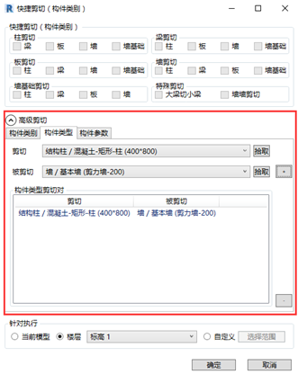

在“构件参数”选项板中，可以通过“过滤条件”和“类型参数”选择剪切对，也可以“导入扣减规则”进行剪切，如下图所示。

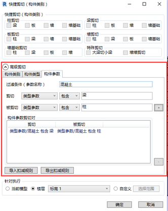

在“一键扣减”对话框中设置扣减规则后，程序会自动搜索所有具有剪切关系的剪切对，快速完成剪切和扣减，如图所示。

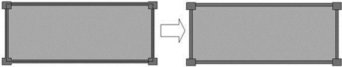

## 洞口防护生成

### 洞口防护智能创建

点击洞口防护智能创建按钮，选择楼板。选择楼板，点击完成。弹出以下对话框。

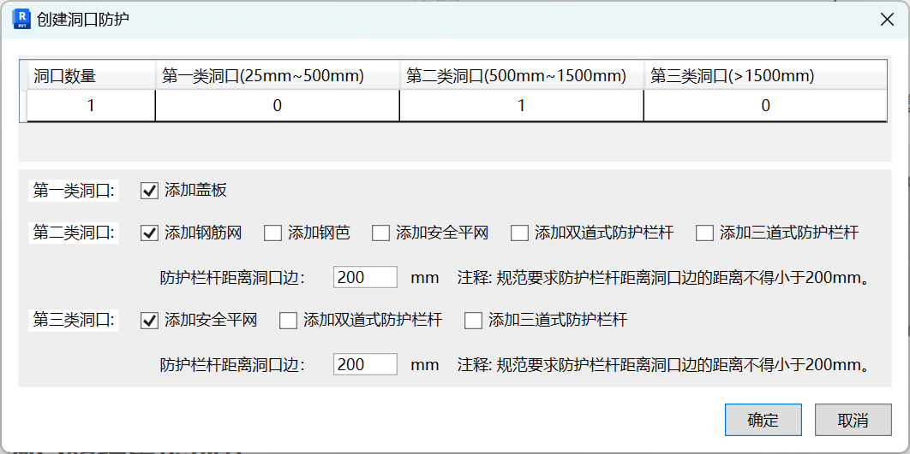

根据洞口类别，勾选洞口防护类型，点击确定生成模型。

# 机电模块

## 快速建模工具

### 链接图纸

运行命令，在弹出的“链接CAD格式”窗口中选择要链接的图纸。注意导入单位以及定位统一。

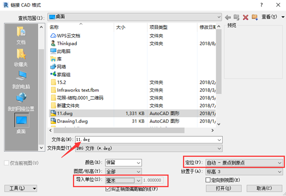

### 多图翻模

单击机电专业下的“多图翻模”按钮，会弹出以下界面。点击“浏览”选择链接或导入各构件的图纸。机电模块下的“多图翻模”功能支持喷淋系统、风管、桥架图纸一键翻模。点击“下一步”。

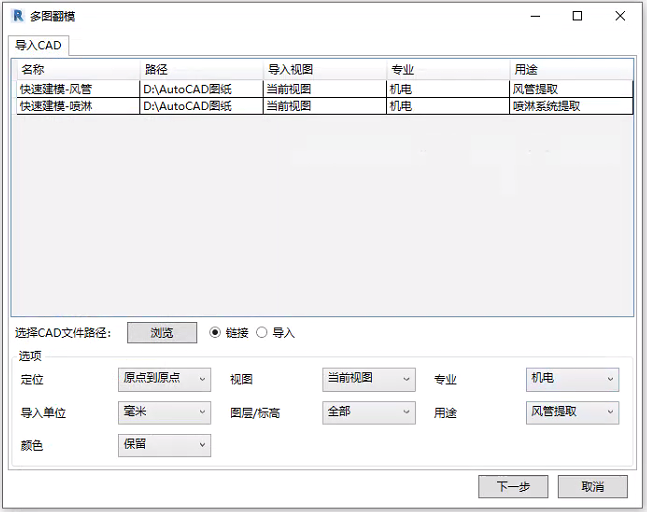

在“DWG快模-机电快速创建”视窗中，点击“拾取”按钮，拾取构件、标注和其余需用户指定的图层。点击“创建”。

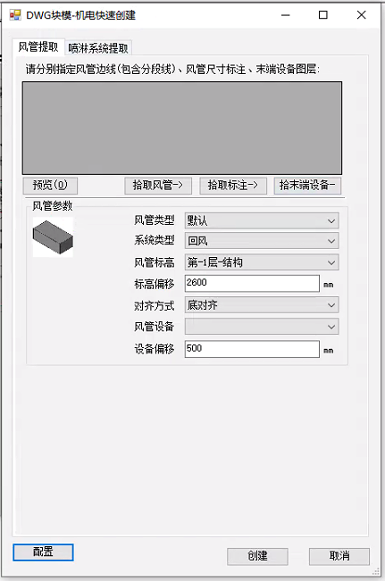

程序将依照图纸，自动创建对应的喷淋系统、风管、桥架。相较单张图纸的翻模功能，多图翻模功能，能够同时为多张同专业的图纸进行翻模。

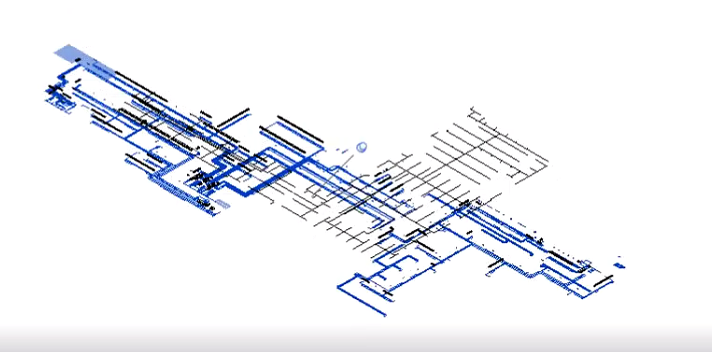

### 喷淋系统

首先需要载入所需喷淋头的族参数。载入所需管道类型。点击喷淋系统选项创建喷淋系统。

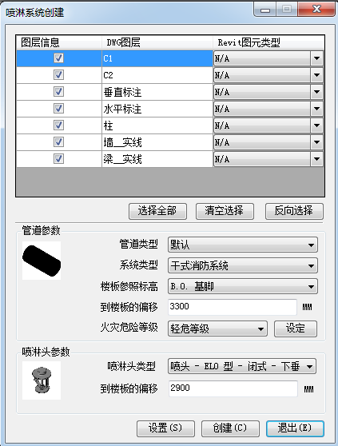

1.图层信息

通过Revit图元类型下拉菜单，可以为管道，管道标注，喷淋选择图层信息。

2.管道参数

管道类型，系统类型，楼板参照标高，到楼板偏移参数可以自行设定。火灾危险等级设定如下图，用户可以添加配置，保存到项目中。

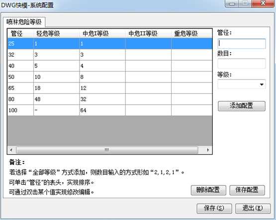

3.喷淋头参数

默认为项目载入的喷淋族，通过设置选项卡，完成喷淋的系统配置。

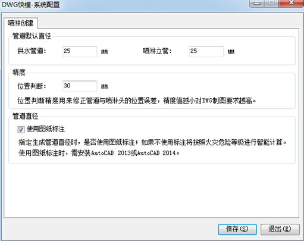

### 风管翻模

首先将风管图纸链接到模型，然后点击风管翻模

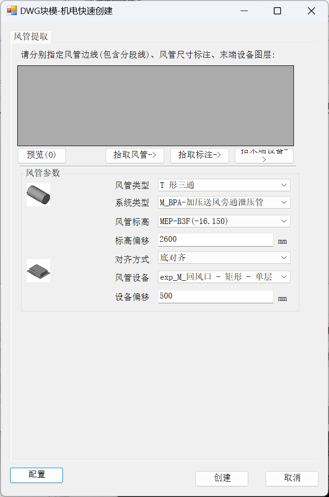

依次点击拾风管，拾取标注，拾取末端设备。设置分管参数，点击创建按钮。生成风管。

### 桥架翻模

首先将桥架图纸链接到模型，然后点击“桥架翻模”。

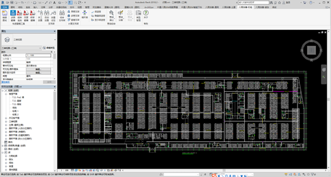

针对程序侦测到的图纸列表，进行细部参数设置，点击“创建”。

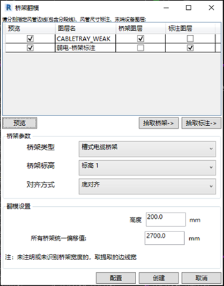

程序将依照图纸中桥架的线条，为模型创建精确位置的桥架。

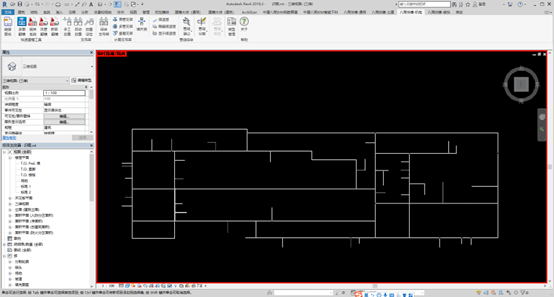

## 支吊架

本插件目前支持的功能为：对建筑结构中常用管道进行手动、自动放置支吊架，并且在管道几何尺寸发生变化时支吊架自动适应。支持的管道类型有：管道（Pipe）、风管（Round Duct/Rectangular Duct）、电缆桥架（Cable Tray）、线管（Conduit）。椭圆形风管（Oval Duct）目前暂不支持。

### 手动放置

点击“手动”后，就可以在管道点击处创建相应的支吊架。

### 自动放置

点击“自动”后，选择一根管道，程序将根据支吊架的布局设置信息自动完成支吊架的创建。

### 放置设定

点击放置设定按钮，弹出支吊架设置对话框，共有6个选项卡，分别对各种支吊架的相关参数进行设置。以管道（Pipe）为例，设置对话框包含两个部分：上半部分参数用于设置支吊架的布置方式，下半部参数用于设置支吊架使用的族文件。

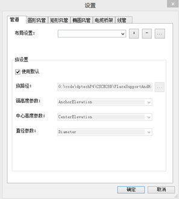

**布局设置**

点击“布局设置”右侧的“+”，可以添加布置，点击“-”可以删除当前下拉框中选择的布置方式，点击“…”可以编辑当前选中的布置方式。在使用插件的自动放置支吊架功能前，相应管道的布局不能为空。

支吊架的布局设置分两种：“自定义”和“简单”。

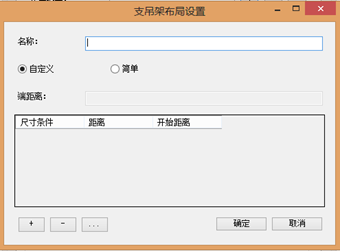

1. “自定义”模式：在该模式下，可以对不同直径或者宽度的管道设置不同的布置方式，例如，“尺寸条件”中输入200mm，距离中输入1000mm，开始距离中输入500mm，则程序在自动放置支吊架时，会对尺寸小于200mm的管道距离某一端500mm自动批量放置支吊架，间距为1000mm。

2. “简单”模式：该模式下，用户可以在“端距离”选项中输入“毫米”为单位的数字，程序会自动在距管道两端点该距离处自动安装两个支吊架（如下图所示）。

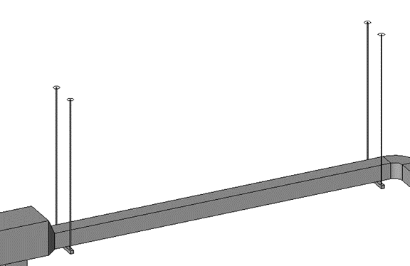

**最低高度**：该参数用于控制设置管道的最低标高，程序将为高于这个标高的管道创建支吊架。

**族文件路径设置：**插件将默认使用该路径下的族文件作为支吊架，用户也可以设置自己的族文件供插件调用。

### 综合支吊架

点击综合支吊架，弹出如下对话框。

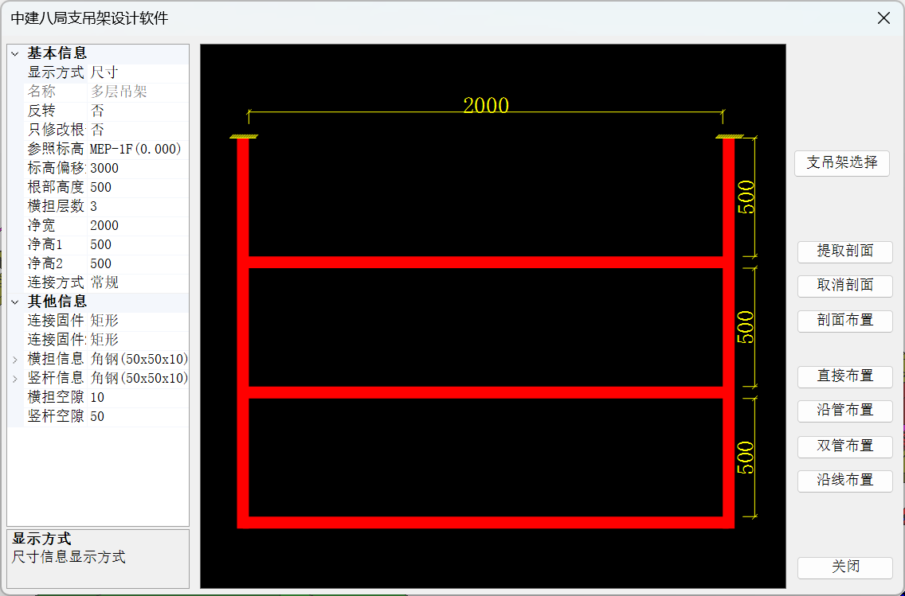

点击支吊架选择，弹出支吊架选择对话框。点击选择一款支吊架，点击选择进行选中。

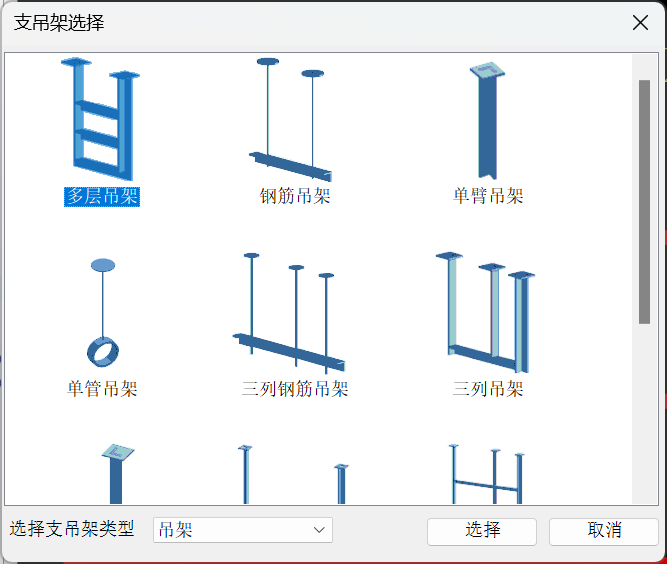

点击提取剖面，从图中选择管道，获取支吊架的外围尺寸。

点击取消剖面，取消选择的剖面信息。

点击剖面布置，按照提取剖面的管道位置进行支吊架布置。

点击直接布置，在图元中任意绘制支吊架。

点击沿管布置，选择管道，在管道上按间距进行支吊架布置，若在提取剖面下，按提取剖面的管道位置进行布置。

点击双管布置，选择另外两个外围管道，在管道上按间距进行支吊架布置。

点击沿线布置，沿曲线按间距进行支吊架布置。  

## 计算支吊架

点击单管支架，选择选择一个管道，弹出以下界面。

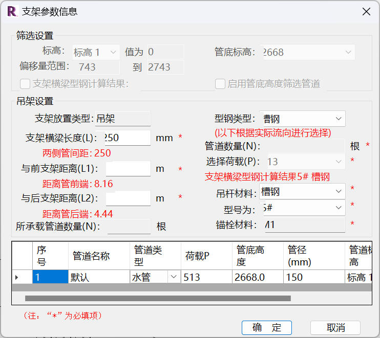

设置吊架设置参数，参数设置完毕后，点击确定，生成支架。

点击多管支架，沿管道横截面方向，点击2个点（位置），弹出以下界面。

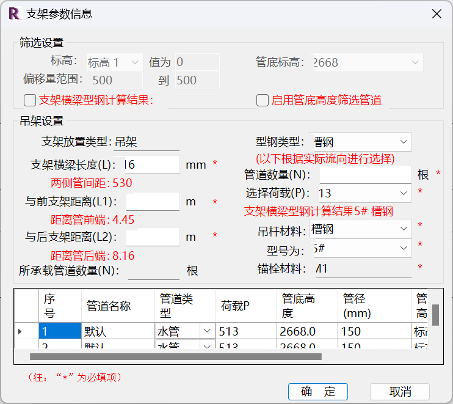

设置吊架设置参数，参数设置完毕后，点击确定，生成支架。

点击查看支架，选择一个支架，弹出以下界面，显示支架信息。

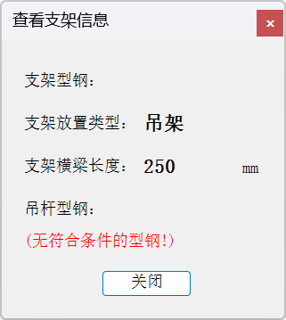

## 管线综合

### 墙开洞

单击墙开洞，其弹出对话框如图所示。通过选择风管、水管、电缆桥架等确定不同的开洞。当具体尺寸不确定时，一般选择在风管上加尺寸。

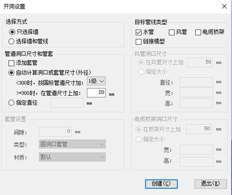

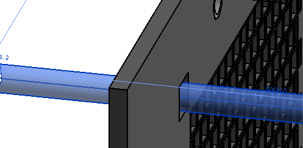

### 保温层

选择项目中各个元素，筛选出和风管水管有关的项后，选择管线保温层，出现下面视图

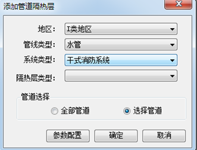

选择，各种类型后，参数设置选项进行参数的设置，具体各项如下图，设置完成后确定，此处可以进行全部管道也可以选择管道。

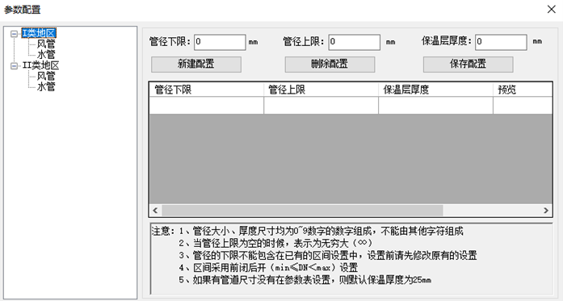

隐藏保温层

点击隐藏保温层，隐藏选中管线的保温层。

显示保温层

点击显示保温层，显示选中管线的保温层。

### 管线避让

1) 管线避让

单击“管线避让”按钮，在管线上选择需要避让的两端，会弹出“变高设置”对话框，选择约束条件，单击确定即可实现管线避让。

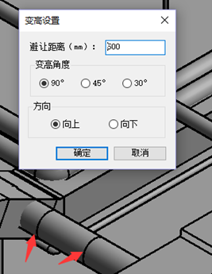

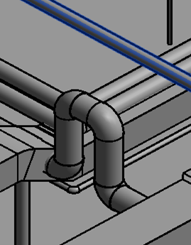

2) 单边避让

单击“单边避让”按钮，在管线上选择需要避让的点，再单击管道需要避让的一边，会弹出“变高设置”对话框，选择约束条件，单击确定即可实现管线避让。

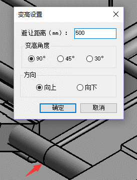

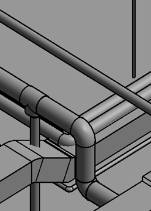

3) 中间多排避让

单击“中间多排避让”按钮，可以选择多排管道进行避让，在管线避让的基础上建立的，之后在每根管线上选择需要避让的两端，会弹出“变高设置”对话框，选择约束条件，单击确定即可实现管线避让。

4) 单边多排避让

单击“单边避让”按钮，在管线上选择需要避让的点，再单击管道需要避让的一边，会弹出“变高设置”对话框，选择约束条件，单击确定即可实现管线避让。

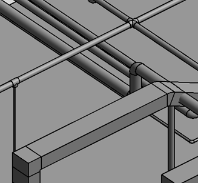

### 管线分割

1) 手动分割

单击“手动分割”按钮，弹出“管道类型及连接件选择”窗口，选择管道类型以及连接件。点击“确定”按钮，选择需要分割的管道即可进行分割。

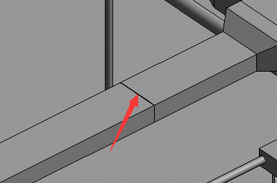

2) 自动分割

单击“自动分割”按钮，弹出“管道类型及连接件选择”窗口，选择管道类型以及连接件。点击“确定”按钮，选择需要分割的管道类型，点击“完成”按钮，在弹出的“分割间距”里设置“分段间距”。即可进行分割。

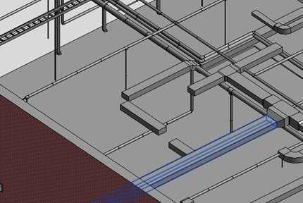

### 管线标注

注意：管线标注只限在平面视图内使用。

1) 管线标注

单击“管线标注”按钮，弹出“管线标记”窗口，选择管道类型以及设置约束条件。点击“确定”按钮，即可进行管线标记。

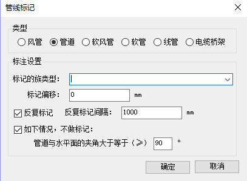

2) 全文标注

单击“全文标记”按钮，弹出“管线标记”窗口，选择管道类型以及设置约束条件。点击“确定”按钮，即可进行管线标记。

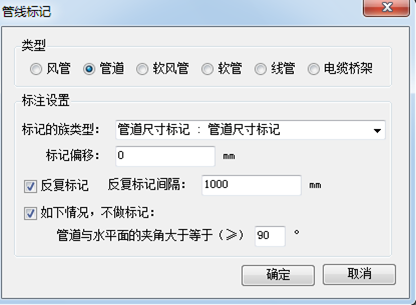

### 类型管理

单击“类型管理”按钮，弹出“管线类别管理”窗口，选择现有管线系统的任意一个管线，即可对其进行编辑复制和删除。点击“确定”按钮，即可应用实现。

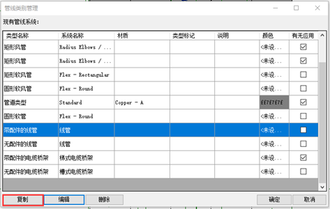

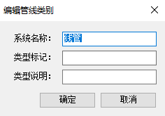

# 装饰模块

## 装饰装修工具

### 房间装饰

点击房间装饰，弹出如下对话框。

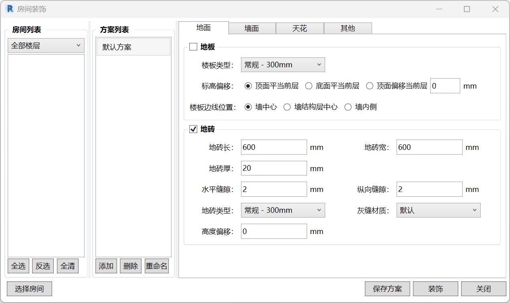

分别对地面，墙面，天花，其他等界面进行设置，点击保存方案。在房间列表，勾选房间。在方案列表选择保存的方案，点击装饰，完成房间装饰。装饰完成后，点击关闭按钮，关闭对话框。

### 墙体砌块

点击墙体砌块，弹出如下对话框。

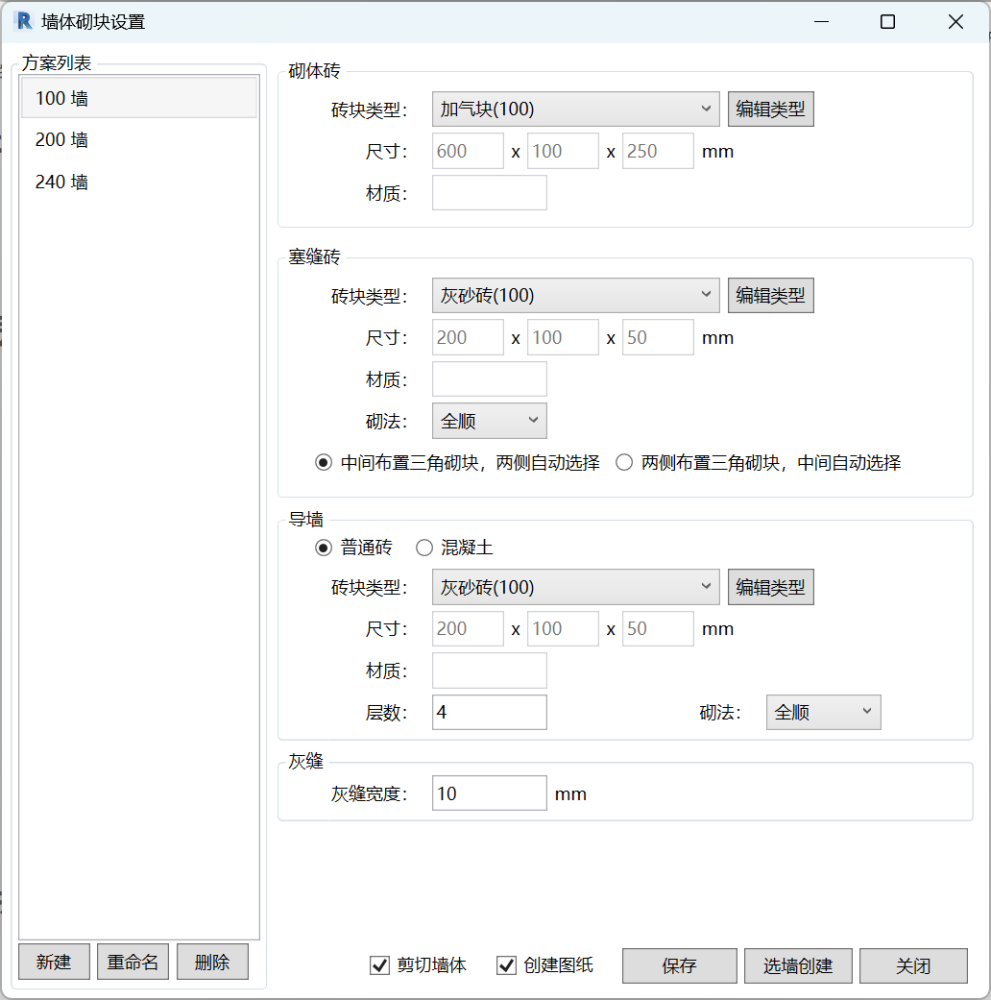

点击新建按钮，创建砌块设置方案。设置砌体砖、塞缝砖、导墙、灰缝等尺寸及材质参数。点击保存，保存方案。选择勾选剪切墙体，生成砌体对墙体进行剪切。勾选创建图纸，生成模型同事创建图纸。参数设置完成后，点击选墙创建按钮，选择墙体，单击完成按钮。生成砌体模型。勾选创建图纸情况下，生成完成后，自动打开图纸窗口。

注意：只能选择建筑墙体。

### 砌块出图

点击砌块出图按钮，选择墙体砌块功能生成砌块的后的墙体，点击完成按钮，生成砌块图纸。生成完成后，自动打开图纸窗口。

### 房间面层

选择房间面层选项后，弹出如下界面。

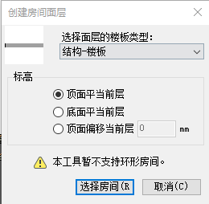

对其设置约束条件，再点击“选择房间”按钮，选择完后单击“完成”，即可

### 抹灰面层

选择抹灰面层选项后，弹出如下界面。

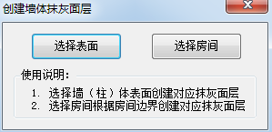

点击选择表面，选择某面墙，可以选择多面，完成后，出现下面窗口，通过下拉菜单，可以设置不同类型的表面，设置抹灰层高度。抹灰高度以墙底面标高为0，向上计算。

### 梁面抹灰

单击“梁面抹灰”按钮，选择需要进行抹灰的梁即可自动进行抹灰。

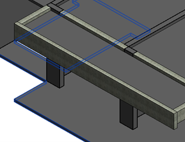

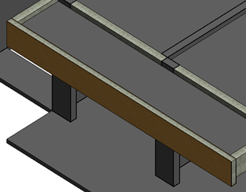

### 批量梁抹灰

单击“梁面抹灰”按钮，选择需要进行抹灰的梁即可自动进行抹灰（框选）。

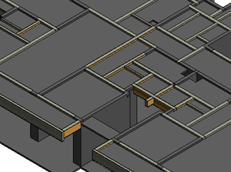

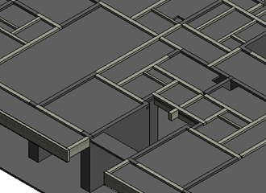

### 墙面排砖

墙面排砖，选择墙面排砖选项，选择需要排砖的墙体，会弹出如下窗口，填入各参数值，确定并保存，勾选以保存模板中选取，下拉菜单可以选择保存过的模板。

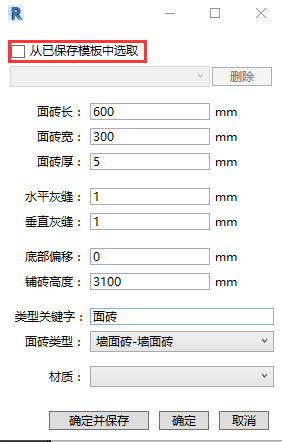

### 屋面排砖

点击屋面排砖按钮，选择要贴砖的屋面面层，选择完成后点击完成按钮。弹出如下弹窗。

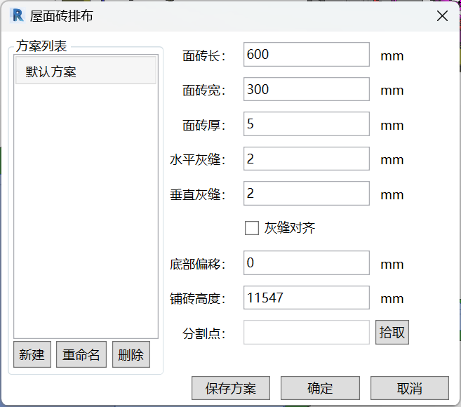

点击新建按钮，创建屋面砖排布方案。设置面砖及灰缝参数。点击保存方案，保存设置参数。选择方案，点击确定按钮，创建屋面砖。点击取消，不进行创建。

### 吊顶地砖

选择某个构件，单击吊顶地砖选项后弹出下面视图，勾选创建地砖，创建吊顶可以显示各参数列表，填入需要的参数，创建。

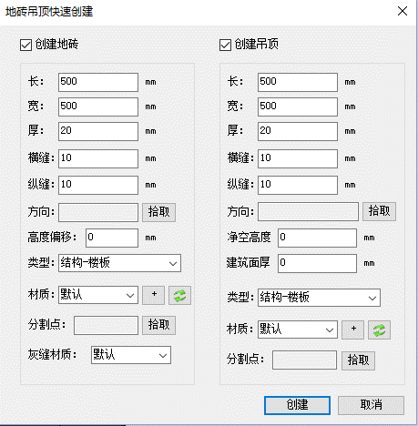

### 模板面积

选择模板面积弹出如下视图，通过选择不同的计算方式，开始计算。

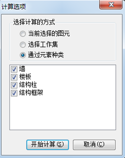

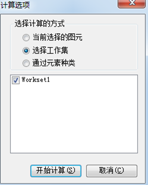

计算结果如下图.

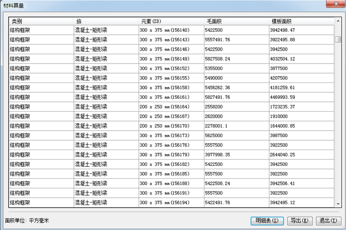

通过选中某个构件列表信息，可以实现模型中高亮显示。

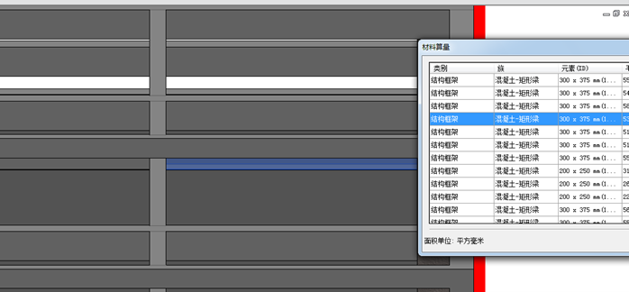

导出选项可以实现导出明细表，另存在其他位置。

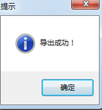

明细表选项，是生成明细表，Revit里面可以显示。

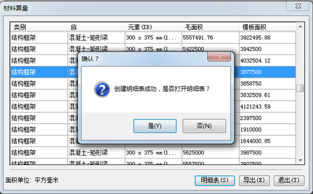

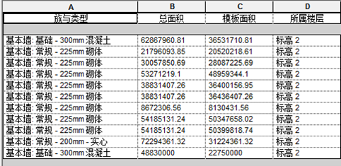

### 计算设定

选择计算设定弹出如下视图，通过对计算设定的面积单位、精度等进行选择，对计算规则进行勾选，按“确定”按钮生效。

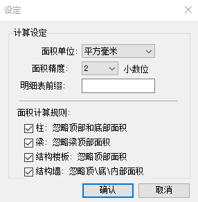
